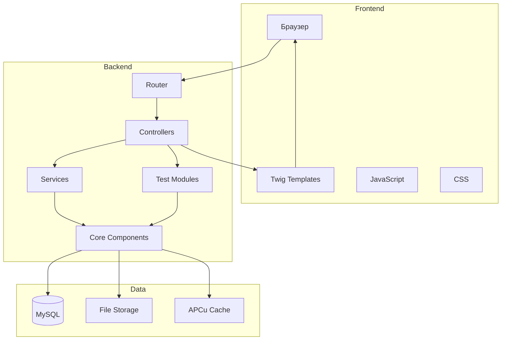
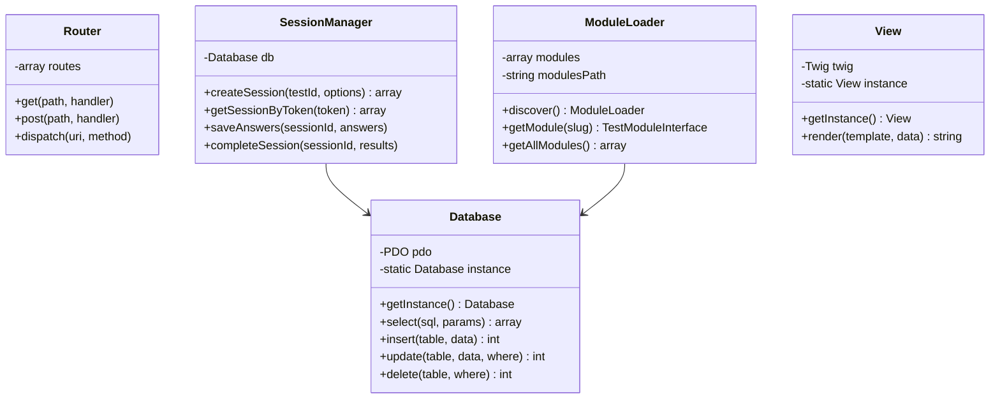
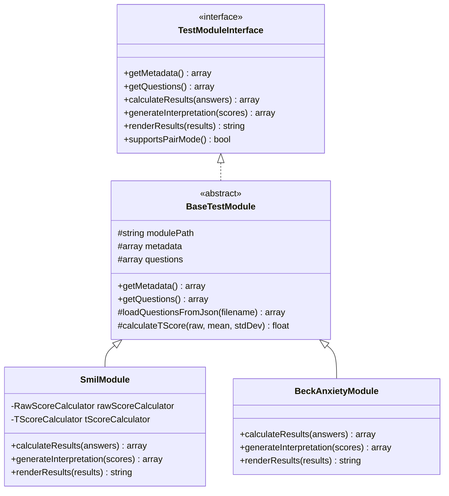
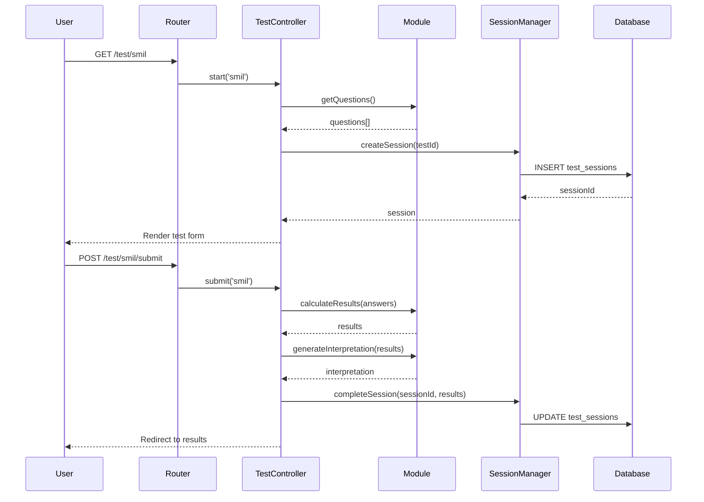
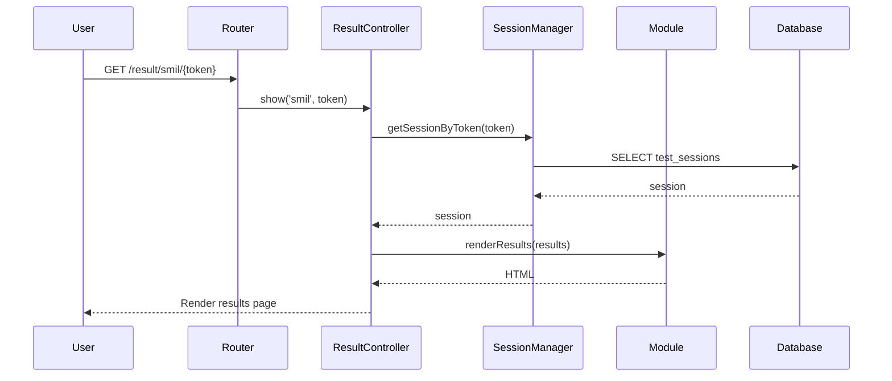

# Архитектура PsyTest Platform

**Версия:** 1.0  
**Дата:** 26 февраля 2026  
**Статус:** Актуально

---

## 📋 Содержание

1. [Обзор системы](#обзор-системы)
2. [Архитектурные принципы](#архитектурные-принципы)
3. [Слои архитектуры](#слои-архитектуры)
4. [Диаграммы](#диаграммы)
5. [Компоненты](#компоненты)
6. [Потоки данных](#потоки-данных)
7. [Безопасность](#безопасность)
8. [Масштабируемость](#масштабируемость)

---

## 🎯 Обзор системы

### Назначение

**PsyTest Platform** - модульная веб-платформа для проведения психологических тестов с профессиональным анализом результатов.

### Ключевые возможности

- 🧩 **Модульная архитектура** - легкое добавление новых тестов
- 🔐 **Безопасность** - защита данных, CSRF/XSS защита
- 📊 **Визуализация** - профессиональные графики и отчеты
- 💳 **Монетизация** - интеграция платежей (ЮMoney)
- 🤖 **AI-интерпретация** - расширенный анализ через OpenRouter
- 📄 **PDF-отчеты** - автоматическая генерация документов
- 👥 **Парные тесты** - сравнение результатов партнеров

### Технологический стек

| Компонент | Технология | Версия |
|-----------|------------|--------|
| Backend | PHP | 8.1+ |
| Database | MySQL/MariaDB | 5.7+/10.2+ |
| Template Engine | Twig | 3.x |
| PDF Generation | DomPDF | 2.x |
| Logging | Monolog | 3.x |
| Frontend | Vanilla JS | ES6+ |
| Charts | Chart.js | 4.x |
| CSS | Custom | - |

---

## 🏛️ Архитектурные принципы

### 1. Модульность (Modularity)

Каждый психологический тест - независимый модуль:

```
modules/
├── smil/              # Модуль СМИЛ
│   ├── SmilModule.php
│   ├── metadata.json
│   └── questions.json
└── beck-anxiety/      # Модуль Beck Anxiety
    ├── BeckAnxietyModule.php
    ├── metadata.json
    └── questions.json
```

**Преимущества:**
- ✅ Изоляция кода
- ✅ Независимая разработка
- ✅ Легкое тестирование
- ✅ Возможность отключения модулей

### 2. Разделение ответственности (Separation of Concerns)

Четкое разделение на слои:

```
Presentation Layer (View)
    ↓
Controller Layer (Logic)
    ↓
Service Layer (Business Logic)
    ↓
Data Layer (Database)
```

### 3. DRY (Don't Repeat Yourself)

- Базовые классы для общей логики
- Переиспользуемые компоненты
- Утилиты и хелперы

### 4. SOLID принципы

- **S**ingle Responsibility - каждый класс одна задача
- **O**pen/Closed - открыт для расширения, закрыт для модификации
- **L**iskov Substitution - модули взаимозаменяемы
- **I**nterface Segregation - интерфейсы специфичны
- **D**ependency Inversion - зависимость от абстракций

### 5. Безопасность по умолчанию (Security by Default)

- Валидация всех входных данных
- Prepared statements для SQL
- CSRF токены для форм
- XSS защита через Twig
- Криптографические токены сессий

---

## 📚 Слои архитектуры

### Общая структура

```
┌─────────────────────────────────────────────────────────┐
│                    PRESENTATION LAYER                    │
│  Templates (Twig) │ CSS │ JavaScript │ Static Assets    │
└─────────────────────────────────────────────────────────┘
                            ↓
┌─────────────────────────────────────────────────────────┐
│                    CONTROLLER LAYER                      │
│  HomeController │ TestController │ ResultController     │
│  ApiController                                           │
└─────────────────────────────────────────────────────────┘
                            ↓
┌─────────────────────────────────────────────────────────┐
│                     SERVICE LAYER                        │
│  PaymentService │ AIInterpretationService │ EmailService│
└─────────────────────────────────────────────────────────┘
                            ↓
┌─────────────────────────────────────────────────────────┐
│                     MODULE LAYER                         │
│  TestModuleInterface ← BaseTestModule ← ConcreteModules │
└─────────────────────────────────────────────────────────┘
                            ↓
┌─────────────────────────────────────────────────────────┐
│                      CORE LAYER                          │
│  Database │ Router │ SessionManager │ ModuleLoader      │
│  View │ PDFGenerator │ Security │ LoggerFactory         │
└─────────────────────────────────────────────────────────┘
                            ↓
┌─────────────────────────────────────────────────────────┐
│                      DATA LAYER                          │
│  MySQL Database │ File Storage │ Cache (APCu)           │
└─────────────────────────────────────────────────────────┘
```

---

## 📊 Диаграммы

### Диаграмма компонентов



### Диаграмма классов (Core)



### Диаграмма классов (Modules)



---

## 🔧 Компоненты

### Core Layer

#### Database

**Назначение:** Управление подключением к БД и выполнение запросов

**Паттерн:** Singleton

**Методы:**
```php
Database::getInstance(): Database
select(string $sql, array $params = []): array
selectOne(string $sql, array $params = []): ?array
insert(string $table, array $data): int
update(string $table, array $data, array $where): int
delete(string $table, array $where): int
```

**Особенности:**
- PDO с prepared statements
- Автоматическое переподключение
- Логирование запросов
- Обработка ошибок

---

#### Router

**Назначение:** Маршрутизация HTTP-запросов к контроллерам

**Паттерн:** Front Controller

**Методы:**
```php
get(string $path, callable $handler): void
post(string $path, callable $handler): void
dispatch(string $uri, string $method): void
```

**Маршруты:**
```php
GET  /                          → HomeController::index
GET  /tests                     → HomeController::tests
GET  /test/{slug}               → TestController::start
POST /test/{slug}/submit        → TestController::submit
GET  /result/{slug}/{token}     → ResultController::show
POST /api/webhook/payment       → ApiController::paymentWebhook
```

---

#### SessionManager

**Назначение:** Управление сессиями тестирования

**Методы:**
```php
createSession(int $testId, array $options): array
getSessionByToken(string $token): ?array
getSessionById(string $id): ?array
saveAnswers(string $sessionId, array $answers): void
completeSession(string $sessionId, array $results): void
deleteSession(string $sessionId): void
```

**Особенности:**
- UUID для идентификации
- Криптографические токены
- Автоматическое истечение (TTL)
- JSON хранение данных

---

#### ModuleLoader

**Назначение:** Обнаружение и загрузка модулей тестов

**Методы:**
```php
discover(): ModuleLoader
getModule(string $slug): ?TestModuleInterface
getModuleMetadata(string $slug): ?array
getAllModules(): array
hasModule(string $slug): bool
```

**Процесс загрузки:**
1. Сканирование директории `modules/`
2. Поиск файлов `*Module.php`
3. Проверка реализации `TestModuleInterface`
4. Регистрация модуля
5. Кэширование (опционально)

---

#### View

**Назначение:** Рендеринг Twig-шаблонов

**Паттерн:** Singleton

**Методы:**
```php
View::getInstance(): View
render(string $template, array $data = []): string
```

**Особенности:**
- Автоматическое экранирование (XSS защита)
- Кэширование шаблонов
- Глобальные переменные
- Пользовательские фильтры

---

### Module Layer

#### TestModuleInterface

**Назначение:** Контракт для всех модулей тестов

**Обязательные методы:**
```php
getMetadata(): array
getQuestions(): array
calculateResults(array $answers): array
generateInterpretation(array $scores): array
renderResults(array $results): string
supportsPairMode(): bool
comparePairResults(array $results1, array $results2): array
getTestTemplate(): ?string
getResultTemplate(): ?string
getCustomJavaScript(): ?string
```

---

#### BaseTestModule

**Назначение:** Базовая реализация общей логики

**Предоставляет:**
- Загрузку метаданных из JSON
- Загрузку вопросов из JSON
- Расчет T-scores
- Нормализацию ответов
- Валидацию данных

**Наследуемые методы:**
```php
loadQuestionsFromJson(string $filename): array
calculateTScore(float $rawScore, float $mean, float $stdDev): float
normalizeScore(float $score, float $min, float $max): float
getInterpretationLevel(float $score, array $thresholds): string
validateAnswers(array $answers, array $questions): bool
```

---

### Controller Layer

#### BaseController (планируется)

**Назначение:** Общая логика для всех контроллеров

**Предоставляет:**
```php
getModuleOrFail(string $slug): TestModuleInterface
getTestOrFail(string $slug): array
jsonResponse(array $data, int $statusCode): void
errorResponse(string $message, int $statusCode): void
```

---

#### TestController

**Назначение:** Управление процессом тестирования

**Методы:**
```php
start(string $slug): void              # Начать тест
save(string $slug): void               # Сохранить ответы (AJAX)
submit(string $slug): void             # Отправить тест
pairStart(string $slug): void          # Начать парный тест
pairSubmit(string $slug): void         # Отправить парный тест
```

---

#### ResultController

**Назначение:** Отображение результатов

**Методы:**
```php
show(string $slug, string $token): void           # Показать результаты
downloadPdf(string $slug, string $token): void    # Скачать PDF
requestInterpretation(string $token): void        # Заказать AI-интерпретацию
```

---

### Service Layer

#### PaymentService

**Назначение:** Интеграция с ЮMoney

**Методы:**
```php
createPayment(string $sessionId, float $amount): array
verifyWebhook(array $payload, string $signature): bool
processPayment(array $webhookData): void
```

---

#### AIInterpretationService

**Назначение:** Генерация AI-интерпретаций через OpenRouter

**Методы:**
```php
generateInterpretation(array $results): string
saveInterpretation(string $sessionId, string $text): void
```

---

#### EmailService

**Назначение:** Отправка email-уведомлений

**Методы:**
```php
sendResultsEmail(string $email, string $pdfPath): bool
sendInterpretationEmail(string $email, string $text): bool
```

---

## 🔄 Потоки данных

### Поток прохождения теста



### Поток просмотра результатов



---

## 🔐 Безопасность

### Защита от атак

#### SQL Injection

**Защита:** Prepared Statements

```php
// ❌ Небезопасно
$sql = "SELECT * FROM users WHERE id = " . $_GET['id'];

// ✅ Безопасно
$sql = "SELECT * FROM users WHERE id = ?";
$result = $db->select($sql, [$_GET['id']]);
```

#### XSS (Cross-Site Scripting)

**Защита:** Автоматическое экранирование в Twig

```twig
{# Автоматически экранируется #}
{{ user_input }}

{# Явное экранирование #}
{{ user_input|e }}

{# Без экранирования (опасно!) #}
{{ user_input|raw }}
```

#### CSRF (Cross-Site Request Forgery)

**Защита:** CSRF токены

```php
// Генерация токена
$token = Security::generateCsrfToken();

// Проверка токена
if (!Security::verifyCsrfToken($_POST['csrf_token'])) {
    throw new SecurityException('Invalid CSRF token');
}
```

#### Session Hijacking

**Защита:**
- Криптографические токены (32 байта)
- UUID для идентификации
- Проверка IP и User-Agent
- Автоматическое истечение сессий

```php
$sessionToken = bin2hex(random_bytes(32));
$sessionId = Uuid::uuid4()->toString();
```

---

### Валидация данных

#### Входные данные

```php
// UUID
if (!Uuid::isValid($sessionId)) {
    throw new ValidationException('Invalid session ID');
}

// Email
if (!filter_var($email, FILTER_VALIDATE_EMAIL)) {
    throw new ValidationException('Invalid email');
}

// Диапазон
if ($age < 14 || $age > 100) {
    throw new ValidationException('Age out of range');
}
```

#### JSON данные

```php
$data = json_decode($content, true);

if (json_last_error() !== JSON_ERROR_NONE) {
    throw new RuntimeException('Invalid JSON: ' . json_last_error_msg());
}
```

---

## 📈 Масштабируемость

### Горизонтальное масштабирование

**Поддержка:**
- ✅ Stateless архитектура
- ✅ Сессии в БД (не в файлах)
- ✅ Кэширование через APCu/Redis
- ✅ Балансировка нагрузки

**Конфигурация:**
```
Load Balancer
    ↓
┌─────────┬─────────┬─────────┐
│ Web 1   │ Web 2   │ Web 3   │
└─────────┴─────────┴─────────┘
    ↓           ↓           ↓
┌─────────────────────────────┐
│      MySQL Master           │
└─────────────────────────────┘
    ↓           ↓
┌─────────┬─────────┐
│ Slave 1 │ Slave 2 │
└─────────┴─────────┘
```

### Вертикальное масштабирование

**Оптимизации:**
- Индексы БД
- Кэширование запросов
- Оптимизация JSON-полей
- Компрессия статики

### Кэширование

**Уровни:**

1. **APCu** - кэш модулей, конфигурации
2. **MySQL Query Cache** - кэш запросов
3. **Browser Cache** - статические файлы
4. **CDN** - глобальное распределение

---

## 🔍 Мониторинг и логирование

### Логирование

**Уровни:**
- DEBUG - детальная отладка
- INFO - информационные сообщения
- WARNING - предупреждения
- ERROR - ошибки
- CRITICAL - критические ошибки

**Файлы:**
```
storage/logs/
├── app.log           # Основной лог
├── database.log      # SQL запросы
├── security.log      # События безопасности
└── payment.log       # Платежи
```

### Метрики

**Отслеживаемые:**
- Время ответа сервера
- Количество запросов
- Ошибки 4xx/5xx
- Использование памяти
- Загрузка CPU
- Размер БД

---

## 📝 Соглашения о коде

### PSR-12

Код соответствует стандарту PSR-12:
- 4 пробела для отступов
- Открывающая скобка на новой строке для классов/методов
- Строгая типизация (`declare(strict_types=1)`)
- Типы возвращаемых значений

### Именование

```php
// Классы: PascalCase
class TestController {}

// Методы: camelCase
public function calculateResults() {}

// Константы: UPPER_SNAKE_CASE
const MAX_QUESTIONS = 566;

// Переменные: camelCase
$sessionToken = '...';

// Приватные свойства: camelCase с префиксом
private $moduleLoader;
```

---

## 🚀 Развертывание

### Требования

- PHP 8.1+
- MySQL 5.7+ / MariaDB 10.2+
- Apache/Nginx
- Composer
- APCu (опционально)

### Процесс

1. Клонирование репозитория
2. `composer install`
3. Настройка `.env`
4. `php bin/install-db.php`
5. Настройка веб-сервера
6. Проверка работоспособности

---

**Конец документации**
