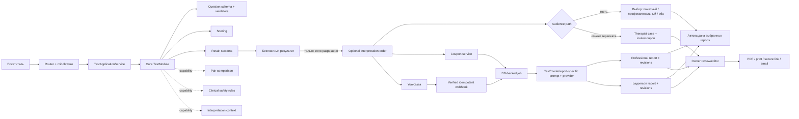

# PsyTest: техническое задание для ИИ-агента

Дата аудита: 2026-08-15

Исходная ветка: `main`, commit `6c51cc3`
Назначение: пошагово довести платформу до безопасного бесплатного пилота, затем до платной **необязательной** интерпретации результатов отдельных сложных методик.

## 1. Неподвижные продуктовые правила

Эти правила нельзя менять «ради удобства реализации».

1. Все тесты бесплатны.
2. Полная базовая страница результатов каждого теста бесплатна.
3. Платной может быть только дополнительная расширенная интерпретация уже полученного результата.
4. Платная интерпретация включается не для всех тестов. На первом релизе кандидаты: SMIL/MMPI и Lazarus. Для BAI, BDI и HADS платного CTA нет.
5. Отдельного пользовательского каталога платных продуктов нет. CTA показывается только на странице подходящего результата.
6. Стартовая цена — 120 ₽. Владелец меняет её в защищённом кабинете без изменения кода; заказ хранит неизменяемый snapshot цены.
7. Для клиентов терапевта нужны 100%-ные купоны. Рекомендуемый формат — уникальные одноразовые коды.
8. Оплата только через YooKassa. Владелец — ИП, чеки YooKassa подключены.
9. Платформа остаётся модульной: единое ядро и UI поддерживают тесты разных механик без условных веток по slug в общих контроллерах.
10. Тестовый результат, PDF результата и удаление данных не должны зависеть от покупки интерпретации.
11. Перед оплатой гость выбирает `Понятный разбор для себя`, `Профессиональное заключение` или `Оба варианта` (рекомендуемый default). Профессиональный вариант всегда полный; понятный вариант полный по смыслу, но переводит термины и использует более бережный язык.
12. Для Lazarus поддерживаются отдельные индивидуальная и парная интерпретации.
13. Одноразовые купоны создаются в минимальном защищённом кабинете владельца; «секретный URL» не считается аутентификацией.
14. Базовое scoring core SMIL и Lazarus заморожено до появления отдельного доказанного дефекта. Работа по дополнительным шкалам SMIL не должна менять базовые 13 шкал.
15. Целевой объём дополнительных шкал SMIL — 110 проверенных определений, добавляемых пакетами.
16. SMIL должен достичь содержательного feature parity с результатом psytests.org, но не копировать его визуальный стиль и не иметь runtime-зависимости от сайта.
17. Классический график SMIL (L/F/K отдельно, визуальный разрыв, шкалы 1–9 и 0) — утверждённый инвариант. Не заменять его radar/bar/cards; допускаются только исправления адаптивности, PDF и accessibility без изменения профессиональной формы.
18. Клиент терапевта получает базовый результат сразу, но расширенный отчёт не отправляется автоматически. ИИ создаёт два черновика на одном наборе результатов: полный профессиональный и понятный клиентский; терапевт может изменить или одобрить клиентский вариант без изменений.
19. Профессиональный оригинал и клиентская редакция версионируются независимо. Редактирование клиентской копии никогда не изменяет полный оригинал.
20. Никакой общий «этический» или «смягчающий» промпт не фильтрует содержание отчёта. Каждый test/mode/report-kind имеет самостоятельный prompt. Бережный язык задаётся только в выбранном `layperson`-промпте; общим может быть лишь технический формат и запрет выдумывать отсутствующие данные.
21. На пилоте `layperson`, `professional` и `both` стоят одинаково — 120 ₽. Это одна услуга с выбором формы результата; ценовую модель можно изменить позже через backend settings.

## 2. Стратегия переделки

Не выполнять ни «косметический ремонт всего подряд», ни big-bang rewrite.

### Сохранить и эволюционно рефакторить

- `Router`, Twig и текущую лёгкую MVC-основу;
- проверенные алгоритмы расчёта методик;
- `ResultSection` и структурный рендеринг результатов;
- рабочий жизненный цикл прохождения теста;
- существующие golden/reference-тесты;
- текущий внешний вид страницы результата как визуальную основу.

### Перепроектировать существенно

- авторизацию ссылками-токенами и границы session/invite tokens;
- серверный контракт валидации ответов;
- модульный API разных типов тестов;
- data lifecycle: удаление, срок хранения, приватные заголовки и журналирование.

### Заменить целиком

- `PaymentService` в текущем виде;
- `ApiController::yoomoneyWebhook()`;
- незавершённый payment/interpretation branch в `ResultController`;
- старые YooMoney env-переменные и quickpay URL;
- существующую схему, где `ai_interpretations` одновременно изображает заказ, платёж и готовый контент.

### Не переходить на большой фреймворк автоматически

Текущий граф содержит 830 узлов, 1165 связей и не обнаруживает циклов импортов. Есть 85 проходящих тестов. Полный framework rewrite следует рассматривать только если после этапов 1–3 одновременно выполняются условия:

- новый модуль нельзя добавить без изменения минимум трёх общих контроллеров;
- безопасность/транзакции невозможно централизовать middleware/service-слоем;
- более 30% regression-тестов приходится переписать из-за инфраструктуры, а не поведения;
- поддержка текущего Router/Database объективно дороже миграции, что подтверждено оценкой задач, а не вкусом разработчика.

До такого решения платёжный контур можно переписать внутри текущего приложения.

## 3. Проверенный baseline

Перед первой правкой агент должен воспроизвести baseline и сохранить вывод в PR/WORKLOG:

```bash
composer validate --strict --no-check-publish
composer audit
vendor/bin/phpunit --testdox
vendor/bin/phpstan analyse core controllers services modules --level=6 --memory-limit=512M
vendor/bin/php-cs-fixer fix --dry-run --diff --allow-risky=yes
php bin/check-architecture.php
```

Зафиксированные результаты аудита:

- PHPUnit: 85 тестов, 1101 assertions, все проходят при доступной MySQL.
- PHP syntax: ошибок нет.
- PHP CS Fixer: fixable-файлов нет, но запускался на PHP 8.5 при минимуме проекта PHP 8.1; не допускать синтаксис выше 8.1.
- PHPStan показывает «No errors», но `phpstan-baseline.neon` скрывает 149 сообщений.
- `bin/check-architecture.php` сломан: принимает `bin/` за корень и падает на `bin/config.php`.
- `dompdf 3.1.5` имеет 6 известных advisory; исправление доступно в 3.1.6.
- `main.css`: 3046 строк; `SmilModule.php`: 1118; `public/test-smil.php`: 709.

Интеграционные тесты нельзя запускать против production/dev БД владельца. Создать отдельный `APP_ENV=test`, отдельную базу, миграции и детерминированную очистку/rollback.

## 4. Подтверждённые дефекты

| ID | Приоритет | Дефект | Основные места |
|---|---:|---|---|
| SEC-01 | P0 | CSRF создаётся, но не проверяется контроллерами | `core/Security.php`, `core/View.php`, все POST routes |
| SEC-02 | P0 | поиск `session_token OR partner_token` может вернуть чужую/не ту сессию | `core/SessionManager.php:88-108`, Result/Test controllers |
| SEC-03 | P0 | slug результата не сверяется с `session.test_id` | `controllers/ResultController.php` |
| SEC-04 | P0 | нет обязательной module-specific валидации диапазона, полноты и ID ответов | `controllers/TestController.php`, modules |
| SEC-05 | P0 | публичные debug/dev scripts | `public/demo.php`, `public/test-smil.php` |
| CLIN-01 | P0 | BDI item 9 не запускает немедленный safety flow | `modules/beck-depression/questions.json:91-99` |
| DEP-01 | P0 | уязвимый dompdf 3.1.5 | `composer.lock` |
| PAY-01 | P0 | route вызывает отсутствующий `ResultController::initiatePayment()` | `public/index.php:74` |
| PAY-02 | P0 | успешная покупка рендерит отсутствующий `interpretation-page.twig` | `controllers/ResultController.php:291-297` |
| PAY-03 | P0 | webhook/verify используют YooMoney form+SHA1, не YooKassa JSON events | `services/PaymentService.php`, `controllers/ApiController.php` |
| PAY-04 | P0 | цена 499 зашита в контроллер | `controllers/ResultController.php:303` |
| AI-01 | P0 | общий prompt ожидает только SMIL `L/F/K` и T-scores | `services/AIInterpretationService.php:67-131` |
| SMIL-ADD-01 | P1 | metadata заявляет 200 дополнительных шкал, JSON содержит 23; у `R`, `Es`, `Do` M выше максимума по ключу | `SmilModule.php:220`, `additional-scales-norms.json` |
| DATA-01 | P0 | privacy claims не соответствуют plaintext БД и передаче в OpenRouter | privacy template, AI service |
| DATA-02 | P1 | soft delete очищает не все связанные данные, хотя UI обещает удаление | SessionManager, related tables |
| PAIR-01 | P1 | invite token не проверяется на тот же тест/завершённую partner session | `TestController::pairStart()` |
| UX-01 | P1 | пустая sticky navigation перекрывает мобильный вопрос | `main.css`, `test-wrapper.twig`, `test-taking.js` |
| UX-02 | P1 | последний ответ BDI оставляет прогресс 20/21 | `public/js/test-taking.js` |
| UX-03 | P1 | dual 1–10 groups не имеют достаточных legend/ARIA/touch targets | Lazarus renderer/template/CSS |
| DOC-01 | P1 | README/ARCHITECTURE/DEVELOPMENT расходятся с кодом | docs |
| CODE-01 | P1 | 149 PHPStan issues скрыты baseline | `phpstan-baseline.neon` |

## 5. Целевая архитектура



Принцип: модуль отвечает за психометрическое поведение и представление результата. Общая платформа отвечает за HTTP, сессии, хранение, безопасность и UI-компоненты. Коммерческое решение «показывать ли CTA» находится во внутреннем конфиге приложения, а не в формулах модуля и не в пользовательском каталоге.

## 6. Module API v2

### 6.1 Минимальное ядро

Не продолжать наращивать неструктурированные массивы в текущем `TestModuleInterface`. Ввести value objects/DTO с PHPStan shapes или typed classes:

```php
interface TestModuleV2
{
    public function definition(): TestDefinition;
    public function questions(): QuestionSet;
    public function validate(AnswerSet $answers): ValidationResult;
    public function score(AnswerSet $answers): TestResult;
    /** @return list<ResultSection> */
    public function resultSections(TestResult $result): array;
}
```

Обязательные данные `TestDefinition`:

- stable `slug`, название и версия методики;
- source/adaptation/version/age range;
- estimated time и количество вопросов;
- supported question types;
- required demographics с объяснением цели;
- retention sensitivity class;
- текст ограничений и disclaimer version.

### 6.2 Capability-интерфейсы

Не добавлять десятки `supportsX(): bool` в базовый интерфейс. Использовать отдельные capabilities:

```php
interface PairComparisonCapability
{
    public function compare(TestResult $first, TestResult $second): PairResult;
}

interface ClinicalSafetyCapability
{
    /** @return list<SafetySignal> */
    public function evaluateSafety(AnswerSet $answers, TestResult $result): array;
}

interface InterpretationContextCapability
{
    public function interpretationContext(TestResult $result, InterpretationMode $mode): InterpretationContext;
}
```

Цена и факт доступности платного разбора **не входят** в эти interfaces. Capability лишь гарантирует, что модуль умеет безопасно подготовить структурированный контекст, если приложение разрешило разбор.

### 6.3 Типы вопросов

Сделать registry стандартных input types:

- `single_choice`;
- `boolean_choice`;
- `likert`;
- `dual_rating` (Lazarus);
- `multi_choice`;
- `number`/`text` только при явной необходимости и с ограничениями.

Каждый тип имеет общий JSON schema, server-side validator, Twig/UI component и JS behavior. Произвольный JS из модуля не должен быть основным extension point. Для действительно нестандартной методики допускается зарегистрированный renderer adapter, но он проходит те же security/accessibility contract tests.

### 6.4 Миграция без big bang

1. Написать `LegacyTestModuleAdapter`, который приводит текущие пять модулей к V2.
2. Перевести Lazarus первым: он проверяет `dual_rating` и pair capability.
3. Перевести BDI: он проверяет safety capability.
4. Перевести BAI/HADS на общие стандартные question/scoring primitives.
5. Перевести SMIL последним под golden-master fixtures.
6. После миграции удалить методы `getResultTemplate()`/`getCustomJavaScript()` или оставить только документированный escape hatch.

### 6.5 Contract test нового модуля

Команда `php bin/check-module.php <slug>` должна проверять:

- JSON/schema/unique question IDs;
- заявленное и фактическое количество вопросов;
- допустимые варианты и диапазоны;
- complete/partial/invalid answer sets;
- сериализацию результата;
- поддерживаемые ResultSection types;
- safety cases;
- pair symmetry/invariants, если capability есть;
- наличие provenance/license metadata;
- отсутствие slug-specific правок в общих controllers.

## 7. Внутренняя настройка платной интерпретации

Не создавать отдельную публичную витрину. Ввести сервис с нейтральным названием, например `InterpretationEligibilityRegistry`. Он определяет допустимые тесты, режимы и handlers, но не является источником актуальной цены:

```php
return [
    'smil' => [
        'individual' => ['enabled' => true, 'handler' => 'smil_v1'],
    ],
    'lazarus' => [
        'individual' => ['enabled' => true, 'handler' => 'lazarus_individual_v1'],
        'pair' => ['enabled' => true, 'handler' => 'lazarus_pair_v1'],
    ],
];
```

Название файла/класса может отличаться. Инварианты:

- BAI/BDI/HADS отсутствуют или `enabled=false`;
- CTA вычисляется только сервером по slug, mode, completed status и capability;
- клиент не может подменить цену, slug, mode или session ID;
- таблица `interpretation_offerings` хранит `test_slug + mode`, `enabled`, `price_kopecks`, `handler_version`, audit timestamps; seed для первого запуска — 12000 копеек;
- владелец меняет цену/доступность в `/admin/settings/interpretations`; только положительное целое число копеек, preview итоговой цены и обязательное подтверждение;
- snapshot цены/handler version сохраняется в заказе, а изменение настройки действует только на новые заказы;
- изменение конфига не меняет уже созданный заказ.

## 8. Данные заказов, купонов и интерпретаций

Создать Phinx migrations. Миграции — единственный source of truth; `database/schema.sql` генерировать как snapshot, не редактировать параллельно вручную.

### `interpretation_orders`

- `id` UUID PK;
- `session_id` FK;
- `test_slug`, `mode`, `handler_version` immutable snapshot;
- `requested_report_bundle`: `layperson|professional|both` immutable snapshot; для `therapist_case` принудительно `both`;
- `base_price_kopecks`, `discount_kopecks`, `payable_kopecks` integer;
- `currency='RUB'`;
- `email` nullable/normalized;
- `payment_status`: `not_required|pending|succeeded|canceled|refunded`;
- `fulfillment_status`: `created|queued|generating|ready|failed|awaiting_review`;
- `audience_path`: `guest_automatic|therapist_case` immutable snapshot;
- `consent_version`, `consented_at`;
- `created_at`, `updated_at`, `paid_at`, `ready_at`;
- один активный заказ одинакового `session_id + mode` либо явная политика повторной покупки.

Не хранить деньги в `float`/`double`.

### `coupons`

- UUID PK;
- `code_hash`, но не plaintext code;
- `label` для владельца;
- `discount_percent` (для первого релиза только 100);
- `allowed_test_slug`/`allowed_mode` nullable;
- `max_redemptions`, `redeemed_count`;
- `valid_from`, `valid_until`, `active`;
- `created_at`, `created_by`.
- `therapist_review=true` для персонального клиентского купона.

Код: криптографически случайный, минимум 128 бит entropy, человекочитаемый Base32 с группировкой. Хэшировать HMAC-SHA-256 с отдельным pepper из env. Сравнивать constant-time. Rate-limit endpoint применения купона.

### `coupon_redemptions`

- UUID PK;
- `coupon_id`, `order_id`, `session_id`;
- `redeemed_at`;
- unique constraints, исключающие повторное использование одноразового купона;
- погашение и перевод заказа в `not_required` выполняются одной DB transaction с row lock.

### `payment_attempts`

- UUID PK;
- `order_id` FK;
- `provider='yookassa'`;
- `provider_payment_id` unique nullable;
- `idempotence_key` unique;
- amount/currency snapshot;
- provider status;
- минимизированный sanitized payload или отдельный audit event;
- timestamps.

### `therapist_cases`

Создаётся владельцем вместе с персональной ссылкой/купоном либо при погашении клиентского купона:

- UUID PK, `owner_id`;
- `label`/псевдоним для поиска в кабинете; не требовать ФИО;
- `test_slug`, `mode`, `session_id` nullable FK;
- `invite_token_hash`, `expires_at`, `used_at`;
- `clinical_context` encrypted JSON nullable: возраст, пол, семейное положение, причина обращения, терапевтический запрос и комментарий специалиста;
- `status`: `invited|in_progress|completed|generating|awaiting_review|approved|delivered|closed`;
- timestamps.

Персональная ссылка связывает прохождение с кабинетом, но не даёт клиенту доступа к `/admin` или профессиональному оригиналу. Сохранять только hash токена. Клинический контекст не обязателен и не должен подставляться из догадок.

### `interpretation_runs`

Одна попытка обращения к модели:

- UUID PK, `order_id` FK;
- `status`, `handler_version`, `prompt_template_version_id`, `provider_code`, `model`;
- structured input hash и schema version;
- provider request id, tokens/cost/latency metadata без чувствительного prompt payload в обычных логах;
- validated structured output либо encrypted short-retention raw response для диагностики;
- error category/attempt count/next_attempt_at;
- timestamps.

### `interpretation_reports`

- UUID PK, `order_id` FK;
- `report_kind`: `professional|layperson`;
- `source_run_id` FK;
- `status`: `draft|approved|superseded`;
- `current_revision_id` FK;
- timestamps;
- unique `order_id + report_kind` для текущего отчёта.

Для `guest_automatic` создаются выбранные `layperson`, `professional` или оба отчёта и публикуются автоматически после структурной валидации. Для `therapist_case` всегда создаются два отчёта отдельными test-specific prompts: полный `professional` и понятный `layperson`. Оба используют один immutable snapshot расчётов; расхождение фактов/баллов между версиями считается ошибкой. Терапевт редактирует `layperson` перед выдачей, но может одобрить его без изменений.

### `report_revisions`

- UUID PK, `report_id` FK, монотонный `revision_number`;
- immutable structured content JSON и rendered text/hash;
- `created_by`: `ai|owner`, `owner_id` nullable;
- optional edit note, timestamps;
- unique `report_id + revision_number`.

Никаких destructive overwrite: сохранение создаёт новую revision; предыдущая доступна для сравнения и восстановления. Профессиональный и клиентский документы имеют независимые цепочки revisions.

### `report_deliveries`

- UUID PK, `report_id`, точный `revision_id`;
- `channel`: `secure_link|email|download|print`;
- `recipient` encrypted/nullable либо безопасная ссылка с hash-token и expiry;
- `status`, `requested_by`, `sent_at`, error category;
- audit timestamps без текста отчёта в логах.

В `therapist_case` отправлять клиенту можно только явно выбранную revision отчёта `layperson` со статусом `approved`; профессиональная версия остаётся доступна владельцу для PDF/печати и может быть отправлена лишь отдельным осознанным действием. Для email по умолчанию предпочтительнее короткоживущая защищённая ссылка; PDF-вложение допускается отдельной настройкой владельца.

Не сохранять полный provider response бессрочно. Старые `ai_interpretations` и `payment_transactions` мигрировать только если там есть реальные данные; иначе удалить после cutover.

## 9. YooKassa

### Создание платежа

1. POST приложения валидирует CSRF, token ownership, completed session, eligibility, consent и email.
2. Сервер создаёт/возвращает существующий order. Повторный double-click не создаёт второй order.
3. Сохраняет `idempotence_key` до сетевого вызова.
4. Вызывает `POST https://api.yookassa.ru/v3/payments` с Basic Auth `shopId:secretKey`.
5. Передаёт `amount`, `capture=true`, redirect confirmation, server-built `return_url`, description и opaque `metadata.order_id`.
6. Добавляет `receipt.customer.email` и один item: название услуги, `quantity=1`, amount, `payment_subject=service`, настроенный `vat_code`.
7. Сохраняет `provider_payment_id/status/confirmation_url`.
8. Возвращает только безопасный redirect URL.

Env:

```dotenv
YOOKASSA_SHOP_ID=
YOOKASSA_SECRET_KEY=
INTERPRETATION_DEFAULT_PRICE_KOPECKS=12000
INTERPRETATION_VAT_CODE=
APP_URL=https://...
```

`INTERPRETATION_VAT_CODE` не задавать по догадке. В production startup должен быть fail-fast, если paid interpretation включён, а обязательные значения отсутствуют.

### Webhook

- новый endpoint `/webhooks/yookassa`, JSON only;
- CSRF exemption только для этого route;
- принимать поддерживаемые события, прежде всего `payment.succeeded` и `payment.canceled`;
- не доверять одному входящему payload: получить объект платежа через YooKassa API и сравнить status, amount, currency, metadata/order;
- обрабатывать в DB transaction с `SELECT ... FOR UPDATE`;
- повтор события возвращает 200 и не меняет уже применённый transition;
- out-of-order/canceled-after-succeeded не откатывает оплаченный order без явной refund логики;
- webhook не вызывает LLM синхронно: он фиксирует оплату и создаёт job;
- отвечать 200 после надёжной фиксации; ошибки логировать без email/токенов/ответов теста.

Redirect пользователя не является подтверждением оплаты. Страница возврата читает состояние order с сервера и показывает `ожидаем оплату / готовим / готово / ошибка`.

### 100%-ный купон

При `payable_kopecks=0` не обращаться в YooKassa. Транзакционно установить `payment_status=not_required`, записать redemption и enqueue interpretation job. Проверить бухгалтерский сценарий отдельно; не эмулировать платёж 0 ₽.

### Минимальный worker

Для self-hosted первого релиза не обязательно добавлять Redis. Достаточна таблица `jobs` с lock/attempts и CLI:

```bash
php bin/worker.php --once
php bin/worker.php --max-jobs=20
```

Запуск через cron/systemd. Job должен быть идемпотентным: готовая interpretation повторно не генерируется, stale lock освобождается, временные ошибки ретраятся с backoff, постоянные уходят в `failed` и видны владельцу.

### Кабинет владельца

Сделать небольшой `/admin`, а не скрытую незащищённую страницу:

- единственный owner account без публичной регистрации;
- Argon2id password, secure session, CSRF, login rate limit; TOTP можно добавить вторым этапом;
- кнопки «Создать приглашение клиенту» и «Создать купон», срок действия, разрешённый test/mode; клиентский сценарий всегда требует явной выдачи владельцем;
- показать код только при создании, дать кнопку копирования; в БД хранить только hash;
- список купонов: active/used/expired/revoked, дата и связанный order без чувствительных ответов;
- очередь `awaiting_review`: исходный бесплатный результат, профессиональный ИИ-оригинал, отдельная клиентская редакция и audit timestamps;
- структурный редактор по разделам, а не редактирование raw HTML; autosave создаёт revisions, есть compare/restore;
- профессиональный оригинал read-only по умолчанию, но владелец может создать его новую ручную revision, не меняя сохранённый исходный AI-вариант;
- понятная клиентская версия генерируется своим test-specific prompt на том же immutable result snapshot; доступны «сохранить черновик», «одобрить без изменений», «одобрить редакцию», «вернуть прежнюю версию»;
- отдельные действия: PDF/печать профессиональной версии, PDF клиентской версии, отправка одобренной клиентской revision по email/защищённой ссылке;
- клиент видит нейтральный статус «разбор проверяет специалист», но не получает черновик до approve;
- owner edit проходит output sanitization; токены клиентов не попадают в URL списка/логи.

Настройки `/admin/settings`:

- цена и enabled-state каждого внутреннего offering;
- AI provider/model по handler, fallback model, timeout, temperature/max output только в допустимых пределах;
- активные версии `professional` и `layperson` test-specific system prompts и case templates;
- draft → test fixtures → publish → rollback для prompt versions;
- masked status API credentials; сами secrets только в env/secret store;
- preview структурированного входа без email, токенов, IP и платёжных данных;
- метрики числа запросов, latency, tokens/cost и ошибок без хранения чувствительного текста в analytics.

## 10. Интерпретация и клиническая безопасность

### Test-specific handlers и prompts

Удалить SMIL-specific `buildPrompt()` из общего сервиса. Общий orchestration знает только `InterpretationContext` и handler version.

- `SmilInterpretationHandler`: полный профессиональный анализ валидности, L/F/K, основных/дополнительных шкал, кода профиля и сочетаний пиков; клинический срез/гипотезы, ресурсы, внутренние противоречия, терапевтические мишени и рекомендации.
- `LazarusIndividualInterpretationHandler`: полный профессиональный анализ доменов удовлетворённости, взаимосвязей показателей, сильных и конфликтных зон, гипотез и направлений работы.
- `LazarusPairInterpretationHandler`: полный анализ результатов обоих, согласованных и расходящихся оценок, структуры отношений, возможных циклов взаимодействия, терапевтических мишеней и тем для обсуждения.

Для BAI/BDI/HADS handlers не регистрировать.

У каждого `handler/mode/report_kind` собственный полный system prompt. `professional` не получает общий ethics/safety prompt и не должен смягчать или скрывать профессионально значимые выводы. `layperson` — самостоятельная выбранная форма: простой и более бережный язык, расшифровка терминов, но без изменения баллов, профиля и значимых тем. Общий код отвечает только за transport, schema и grounding: отсутствующие показатели нельзя выдумывать, а измеренные значения, интегративные выводы и клинические гипотезы должны быть различимы в структуре.

Передавать провайдеру структурированный результат, а не HTML/PDF/скриншот: все approved scales, validity data, профиль и вычисленные связи плюс явно введённый контекст случая. Не отправлять session token, email, IP, user agent и raw payment payload. Демографию и терапевтический запрос включать, если они предоставлены для этого случая и покрыты согласием; не додумывать отсутствующее.

### Prompt registry

Создать versioned `ai_prompt_templates`:

- `handler_code`, `mode`, `report_kind=professional|layperson`, `version`, `status=draft|published|retired`;
- полный `system_prompt`, `case_template`, `output_schema_version`;
- provider/model compatibility metadata;
- author, created/published timestamps, immutable hash;
- ровно одна published version на handler/mode/report-kind.

Публикация только после прогона набора обезличенных fixtures. Нужны fixtures минимум для валидного среднего профиля, выраженного профиля, сомнительной валидности, противоречивых дополнительных шкал, индивидуального Lazarus и пары с сильными расхождениями. Для каждого хранить критерии полноты: обязательные разделы и шкалы, отсутствие придуманных данных, корректная трассировка выводов. Не оценивать качество длиной текста.

Примеры владельца использовать как первый черновик SMIL prompt и как формат клинического контекста. До production запросить у владельца обезличенные комплекты `структурированный результат → использованный prompt → удачный ответ → пометки, что было полезно/лишне/ошибочно`. Lazarus prompt разрабатывать и утверждать отдельно; перенос SMIL prompt недопустим.

### Provider/model registry

Ввести `AIProviderClient` (`generateStructured(request): response`) и явные адаптеры только для реально используемых провайдеров. OpenRouter, прямой Qwen/DeepSeek или другой OpenAI-compatible endpoint не должны ветвиться внутри clinical handlers.

- backend хранит allowlisted `provider_code`, display name, allowed base URL, supported models/capabilities и enabled-state;
- секрет хранится только в именованной env-переменной, а БД содержит ссылку вида `secret_ref=OPENROUTER_API_KEY`, не значение;
- владелец выбирает provider/model отдельно для каждого handler/mode/report-kind и необязательный fallback;
- произвольный URL из формы запрещён, чтобы не создать SSRF/утечку данных;
- при публикации prompt система выполняет connection/schema test на синтетическом fixture без реальных клиентских данных;
- каждый run хранит snapshot provider, model, prompt version, schema version, latency, token usage и рассчитанную стоимость;
- смена модели не меняет уже готовые reports; явная повторная генерация создаёт новый run и revisions.

### Output contract

Для `professional` просить JSON по test-specific схеме, которая допускает полный материал: `profile_summary`, `validity`, `scale_analysis`, `integrative_profile`, `clinical_hypotheses`, `resources`, `therapy_targets`, `recommendations`, `limitations`, а для Lazarus — собственные доменные/парные секции. Для `layperson` схема содержит эквивалентные смысловые разделы простым языком и ссылки на те же source fact IDs. Валидировать и затем рендерить Twig. При invalid output — retry/failed, а не выдача сырого текста.

Обязательные проверки:

- не обрезать клинический материал и не подменять полный разбор утешительным текстом;
- каждое количественное утверждение ссылается на входную шкалу/значение; интегративный вывод и гипотеза маркируются как вывод/гипотеза, а не как измеренный факт;
- если заказано `both`, автоматическая cross-report проверка подтверждает совпадение баллов, направленности шкал и ключевых выводов; различаться должны язык и адресат, а не факты;
- не утверждать, что текст подготовлен живым специалистом, если review не было;
- раскрывать значимые баллы и сочетания с понятным пояснением; полный расчёт остаётся доступен;
- versioned prompt + model + evaluation fixture;
- escape/sanitize markdown/HTML;
- техническая валидация не переписывает и не «смягчает» содержимое; сомнительный output отправляется в retry/manual review, а не молча урезается.

### BDI safety flow

Это отдельная функция бесплатного результата, не AI interpretation.

1. `ClinicalSafetyCapability` BDI создаёт critical signal при item 9 > 0; severity зависит от значения.
2. Сервер вычисляет signal из валидированных ответов и хранит минимально необходимый флаг с ограниченным retention.
3. UI сразу после выбора/при submit показывает заметное, спокойное сообщение, что человеку не нужно оставаться одному и следует обратиться за срочной помощью.
4. Для значений 2–3 не ждать общего score и не прятать сообщение ниже CTA.
5. Сначала всегда показывать универсальный action block: при непосредственной опасности обратиться в местную экстренную службу/ближайшую неотложную помощь, связаться с доверенным человеком и не оставаться одному.
6. `CountryResolver` выбирает страну в порядке: ручной выбор пользователя → сохранённая страна текущей сессии → доверенный country-header reverse proxy или локальная GeoIP-база → `unknown`. Не вызывать сторонний IP API из браузера/сервера и не считать IP достоверным местоположением.
7. UI показывает country selector с возможностью исправить предвыбор и `Другая/не знаю`. Точный IP для кризисной логики не сохранять.
8. Версионированный `crisis_resources` registry: `country_code`, `language`, тип ресурса, название, номер/URL, источник, `last_verified_at`, `verified_by`, active. Источник по возможности официальный; номера без актуальной проверки автоматически не публиковать.
9. Для стран ЕС допустимо показывать 112 после проверки; для остальных стран использовать проверенные локальные данные. Общий fallback — международный каталог Find A Helpline, но он не заменяет сообщение об экстренной помощи.
10. Не отправлять signal/country в маркетинговую аналитику и не использовать для продажи.
11. Добавить unit, HTTP и browser tests: item 9 при низком total score, unknown country, ошибочный GeoIP, ручная смена страны и устаревший ресурс.

## 11. Security и privacy work package

### CSRF

- оставить одну реализацию в `Security`/dedicated middleware;
- token хранить в server session, rotate по политике;
- form POST: hidden input; JSON autosave: `X-CSRF-Token`;
- middleware применяет ко всем state-changing routes, кроме verified webhook;
- invalid/missing token → 403 JSON/HTML по Accept header;
- удалить дубли из `View` после миграции;
- тесты для каждого POST route.

### Token model

- `session_token`: bearer access только к конкретной session;
- `partner_invite_token`: только начало partner flow, не доступ к результату владельца;
- убрать `getSessionByToken()` с OR; использовать явные `getBySessionToken()` и `getInviteContext()`;
- сравнивать route slug/test id с session;
- pair invite валиден только для matching test, completed owner session, not deleted/expired, unused policy;
- все sensitive pages: `Cache-Control: no-store`, `Referrer-Policy: no-referrer`, `X-Robots-Tag: noindex, nofollow`;
- исключить tokens из application/access logs или redact path.

### HTTP/session hardening

- cookies: `Secure`, `HttpOnly`, `SameSite=Lax` (или Strict после проверки redirect flow);
- production HTTPS/HSTS на reverse proxy; корректная trusted-proxy схема;
- CSP вместо устаревшего `X-XSS-Protection`;
- `frame-ancestors`, `nosniff`, sane permissions policy;
- Chart.js локально или с SRI и только на нужных страницах;
- production boot fail-closed: `APP_DEBUG=false`, secrets и APP_URL обязательны.

### Validation/rate limits

- module validator проверяет exact question set, types, ranges, completeness;
- autosave может быть partial, submit — complete;
- неизвестные поля отклонять/игнорировать по явной схеме;
- IP+token rate limits в общем storage, не в PHP session;
- отдельные лимиты: create session, autosave, submit, PDF, coupon apply, payment create, interpretation status;
- upload/SSRF paths для PDF не допускать.

### Data lifecycle

- описать таблицу данных: цель, правовое основание/согласие, срок, удаление;
- ответы/результаты, payment/fiscal records и technical logs имеют разные сроки;
- delete result транзакционно удаляет или необратимо анонимизирует session, pair links, generated PDFs и AI content; обязательные финансовые записи сохраняются отдельно без ответов теста;
- cron cleanup удаляет expired partial sessions и orphan PDFs;
- privacy page описывает OpenRouter/реального провайдера и трансграничную передачу только после юридической проверки;
- убрать недоказанные «152-ФЗ compliant» и «encrypted at rest».

## 12. Этапы реализации

Каждый этап — отдельный небольшой PR/commit series. Не смешивать payment rewrite с CSS cleanup.

### Этап 0 — containment и воспроизводимость

1. Скрыть/feature-flag текущий broken paid CTA.
2. Обновить dompdf до 3.1.6+, Twig/Phinx/PHP-CS-Fixer в совместимых minor/patch; major PHPStan/PHPUnit отдельно.
3. Перенести/delete `public/demo.php` и `public/test-smil.php`; production public root allowlist.
4. Исправить `bin/check-architecture.php` root и документированную команду.
5. Создать test DB workflow; разделить unit/integration suites.
6. Добавить CI: validate, audit, PHPUnit, PHPStan, CS fixer, architecture/module checks.
7. Зафиксировать browser smoke paths.

Acceptance: чистая установка мигрируется; все 85+ tests проходят; composer audit не содержит известных runtime advisories; платная кнопка не ведёт в сломанный route.

### Этап 1 — доступ, CSRF, validation

1. SEC-01–04, PAIR-01.
2. Security headers/cookies/private response policy.
3. Persistent rate limiter.
4. Transactional data deletion и cleanup tests.

Acceptance: отрицательные HTTP tests доказывают 403/404 для чужого invite/session token, slug mismatch, missing CSRF, out-of-range и incomplete submit.

### Этап 2 — clinical/privacy gate

1. BDI item 9 safety flow.
2. Исправить privacy/terms/consents.
3. Зафиксировать provenance/version/license/age metadata всех пяти методик.
4. Владелец подписывает тексты результатов и crisis copy.

Acceptance: низкий total BDI + item 9 > 0 всё равно показывает safety message; ни один внешний вызов не происходит без consent; документация не содержит ложных compliance claims.

### Этап 3 — Module API v2

1. DTO/schema/validator/renderer registry.
2. Legacy adapter.
3. Lazarus → BDI → BAI/HADS → SMIL migration.
4. Contract checker и template для нового модуля.
5. Split `SmilModule`: scoring orchestration, profile, interpretation data, presentation. Не менять формулы без отдельной задачи.

Acceptance: новый sample module добавляется без изменения controllers; все старые reference fixtures идентичны; pair and safety capabilities обнаруживаются type-safe.

### Этап 3B — дополнительные шкалы SMIL

Не смешивать с рефакторингом базового scoring core. Создать typed `AdditionalScaleDefinition`:

- стабильный code/name/category;
- original author/year и назначение;
- source document + edition + exact page;
- true/false key либо явная composite formula;
- male/female M/σ и population/source;
- `validation_status`: `extracted|cross_checked|reference_verified|approved`;
- user-facing label/description и `interpretation_status`;
- version/hash definition.

Локальные источники уже обнаружены:

- `source/Л.Н. Собчик - ...PDF` — скан книги 2003 года, 224 страницы;
- `source/И.Л. Соломин - Личностный опросник MMPI.pdf` — базовые ключи на стр. 63–68 и большая таблица норм дополнительных шкал около стр. 69;
- `source/metod/sob-01.pdf` — большой перечень дополнительных ключей с кодами, авторами и годами, начиная примерно со стр. 41; использовать как индекс/вторичный источник и cross-check;
- `source/MMPI. Общие сведения.pdf` — описания дополнительных шкал;
- сохранённый результат psytests.org и публичный пример; сайт сообщает о 110 рассчитываемых дополнительных шкалах.

Pipeline:

1. Составить source inventory с SHA-256, edition/page mapping и provenance status.
2. Извлекать definitions в промежуточный JSON; OCR/парсинг никогда не считается проверкой.
3. Нормализовать коды и различать одноимённые шкалы разных авторов/редакций.
4. Автоматические invariants: question IDs 1–566, отсутствие дублей/пересечений true-false, `M <= theoretical max` для simple sum, `σ > 0`, formula dependencies существуют.
5. Исправить/переизвлечь текущие `R`, `Es`, `Do`; не подгонять M/σ вручную.
6. Добавлять пакетами по 10–20: keys review → norms review → unit fixtures → независимый reference profile → owner approval.
7. Только `approved` scales попадают в public result и AI context.
8. Публичный UI: краткая сводка значимых проверенных шкал + раскрываемая полная таблица/профессиональный PDF; не выводить 110 строк сразу.
9. Стигматизирующие/исторические названия показывать с современным пояснением и без диагностического вывода.

### SMIL parity checklist

Эталон нужен как спецификация и regression fixture, не как внешний API.

- классический профильный лист: контрольный сегмент + разрыв + основные шкалы;
- 10 основных шкал, L/F/K, Q и контрольные пункты;
- дополнительные шкалы: канонический целевой список; описание psytests.org говорит о 110, локальный сохранённый расчёт содержит 109 уникальных `A*` rows — расхождение расследовать и документировать;
- для каждой простой шкалы: raw, max, M, σ, T; для composite: формула и зависимости;
- видимый ход K-correction и других корректировок;
- мужские/женские нормы и форма вопросов;
- collapsible professional calculation table;
- user summary не скрывает полный расчёт, но и не перегружает первый экран;
- PDF сохраняет профиль, основные/контрольные/дополнительные шкалы и provenance/version footer;
- AI context получает полный approved profile, а не 23 текущих значения;
- никакого scraping/calling psytests.org в production; эталонные HTML/PDF хранятся вне public root и используются только в offline verification.

Для parity regression создать sanitized fixture из сохранённого результата: answers → ожидаемые raw/max/M/σ/T по 13 базовым и целевым дополнительным шкалам. Не включать внешний result token в репозиторий/логи.

Solomin прямо предупреждает, что создано более 400 дополнительных шкал, не все одинаково валидны, а дополнительные шкалы СМИЛ не проходили полноценной ревалидизации/рестандартизации. Поэтому acceptance — не «JSON содержит 110 элементов», а 110 traceable definitions с понятным validation status. До завершения исправить metadata с 200 на фактическое число approved scales.

Acceptance: base 13 golden fixtures byte-for-byte/score-for-score неизменны; все definitions проходят invariants; для каждой approved scale есть точный источник и хотя бы один независимый reference case.

Дополнительный acceptance для parity: отчёт даёт специалисту не меньше вычислительного материала, чем эталонная страница psytests.org; отличие допускается только в пользу более ясного UI, доказательной маркировки и безопасности.

Этап 3B — release gate для платной интерпретации SMIL, но не для бесплатного прохождения SMIL и не для платной интерпретации Lazarus.

### Этап 4 — orders/coupons/YooKassa

1. Новые migrations/repositories/state transitions.
2. Eligibility registry без публичного каталога.
3. Coupon/invite CLI для аварийного/пакетного управления и защищённый owner UI: create, revoke, list usage, привязка к `therapist_case`.
4. Новый YooKassa client, create payment, receipt, verified webhook.
5. Status page и DB job queue.
6. Удалить old YooMoney code после cutover tests.

Acceptance: sandbox payment; duplicate create; duplicate/out-of-order webhook; wrong amount; expired/used coupon; concurrent redemption; 100% coupon without provider call; receipt fixture all covered.

### Этап 5 — interpretation fulfillment

1. Для каждого SMIL/Lazarus mode: отдельные `professional` и `layperson` prompts, schemas и evaluation fixtures.
2. Выбор гостя `layperson|professional|both`, одинаковая цена пилота и immutable order snapshot.
3. Consent/minimal payload.
4. Worker retry/idempotency и cross-report consistency при `both`.
5. Два независимых PDF/renderers, email/secure-link/status/error UX.
6. Therapist case queue: оба черновика, редактор revisions, approve и явная доставка; автоматическая выдача выбранных вариантов гостям.
7. Admin AI settings: provider/model, versioned draft/test/publish/rollback prompts, masked secret status.

Acceptance: BAI/BDI/HADS никогда не показывают CTA; free results доступны до/после purchase; гость может получить любой из трёх вариантов; professional не урезан; `both` не противоречат друг другу по фактам; клиент терапевта ничего не получает до explicit approve; обе версии экспортируются независимо; paid failure не теряет заказ; повтор job не создаёт лишний PDF/LLM charge.

### Этап 6 — UI/UX и frontend cleanup

1. Убрать пустой sticky nav; progress 21/21.
2. Сократить intro; подробности в disclosure.
3. `fieldset/legend`, keyboard, focus, 44px touch targets, contrast.
4. Split CSS: tokens/base/layout/components/pages; удалить duplicate selectors.
5. Conditional assets; убрать global Chart.js.
6. Public catalog/home indexable, private result/payment noindex.
7. Trust layer: владелец, методика, приватность, ограничения, поддержка.
8. Paid CTA вторичен по отношению к бесплатному результату и отсутствует на неeligible tests.
9. Перед оплатой три ясные radio-cards: `Понятный для себя`, `Профессиональный для специалиста`, `Оба (рекомендуем)`; показать один пример фрагмента каждого языка, одинаковую цену и состав PDF без dark patterns.

Acceptance: mobile browser tests 390×844 и desktop; нет overlap/horizontal scroll; keyboard-only complete; Lighthouse/accessibility review без critical issues.

### Этап 7 — документация и production operations

1. `README.md`: быстрый старт и truthful feature list.
2. `ARCHITECTURE.md`: V2 contracts, token model, order/worker/data flows.
3. `DEPLOYMENT.md`: reverse proxy, cron/worker, backups, restore drill, secret rotation, YooKassa webhook.
4. `SECURITY.md`: reporting, supported versions, data classification.
5. `docs/ADDING-A-TEST.md`: schema, capabilities, contract tests, license checklist.
6. Архивировать `docs/superpowers` и старые планы; убрать обязательный Superpowers из `AGENTS.md`.
7. Health checks: DB, disk, queue age; не раскрывать версии/secrets.
8. Structured logs + error monitoring с redaction.

Acceptance: новый агент может поднять test env только по docs; backup restore проверен; worker lag/payment/AI failures наблюдаемы.

## 13. Code cleanup после покрытия тестами

- убрать unused `$moduleLoader`/`$sessionManager` из `public/index.php` либо внедрить один composition root;
- dependency injection для controllers/services, без повторного чтения config в constructors;
- объединить CSRF implementation;
- удалить loose `SessionManager::getSessionByToken()`;
- дедуплицировать submit/pairSubmit normalization;
- вынести общие primitives BDI/BAI/HADS, сохранив отдельные thresholds и semantics;
- удалить dead methods `calculateTScore`, `normalizeScore`, `getInterpretationLevel`, `sanitizeAnswer`, `validateAnswers`, если после V2 нет вызовов;
- удалить неиспользуемые legacy result template/SMIL JS только после route/asset coverage;
- уменьшать PHPStan baseline по подсистемам; новый код не добавляет baseline entries;
- убрать raw `mail()`, использовать один тестируемый mail adapter;
- DB `tests.module_class` либо сделать источником runtime mapping, либо удалить; не поддерживать три конкурирующих реестра.

## 14. Test matrix

Минимальные категории:

- unit: scoring, validators, safety signals, state transitions, coupons, prompt contexts;
- golden master: текущие SMIL/BDI/BAI/HADS/Lazarus fixtures;
- contract: каждый module + renderer;
- HTTP: CSRF, token boundaries, slug mismatch, privacy headers, free result invariant;
- DB integration: migrations up/down, transactions, concurrent coupon redemption, idempotency;
- provider fixtures: YooKassa success/cancel/duplicate/wrong amount/API timeout; никакой production network;
- worker: retry, stale locks, duplicate job, permanent failure;
- AI: schema valid/invalid, timeout, придуманные показатели, неполные секции, расхождение `professional/layperson`, no eligible handler;
- browser: all five tests smoke, Lazarus pair, BDI safety, mobile navigation, coupon, sandbox return status;
- deletion: files + linked rows + retained fiscal data separation.

Не утверждать «готово» без свежего вывода:

```bash
composer validate --strict --no-check-publish
composer audit
composer test
composer analyse
composer lint
php bin/check-architecture.php
php bin/check-module.php --all
```

Плюс browser smoke для затронутого user flow.

## 15. Definition of Done для платного пилота

- все тесты и базовые результаты доступны бесплатно;
- CTA только у подтверждённых SMIL/Lazarus modes;
- цена с сервера, 120 ₽ configurable, integer kopecks;
- перед оплатой доступны `Понятный`, `Профессиональный`, `Оба`; на пилоте цена одинакова и `Оба` отмечен как рекомендуемый;
- профессиональный гостевой отчёт содержит полный предусмотренный test-specific schema материал и не проходит через общий смягчающий prompt;
- понятный и профессиональный варианты при `both` совпадают по расчётам и ключевым фактам;
- одноразовый купон невозможно погасить дважды;
- приглашение/купон можно создать и отозвать в защищённом owner UI; client case ведёт в `awaiting_review`;
- кабинет хранит независимые revisions профессионального и понятного отчётов; клиенту нельзя отправить неодобренный вариант;
- YooKassa sandbox и один контролируемый production smoke payment пройдены владельцем;
- receipt fields подтверждены бухгалтером/настройками YooKassa;
- webhook verified и идемпотентен;
- AI failure не меняет факт оплаты и имеет retry/support path;
- provider получает минимальные данные после явного consent;
- текст не выдаётся за ручную работу специалиста без review;
- BDI safety flow работает независимо от суммы и любых платных функций;
- страна crisis-flow исправляется вручную, IP является только необязательной подсказкой, unknown-country fallback протестирован;
- privacy/terms/license evidence актуальны;
- backup/restore/worker monitoring готовы;
- нет P0/P1 security findings и runtime dependency advisories.

## 16. Внешние спецификации

- YooKassa quick start: <https://yookassa.ru/developers/payment-acceptance/getting-started/quick-start>
- YooKassa API format/idempotency: <https://yookassa.ru/developers/using-api/interaction-format>
- YooKassa webhook: <https://yookassa.ru/developers/using-api/webhooks>
- YooKassa receipts: <https://yookassa.ru/developers/payment-acceptance/receipts/basics>
- Find A Helpline directory/about: <https://findahelpline.com/about>
- European Commission 112: <https://digital-strategy.ec.europa.eu/en/policies/112>
- Pearson BAI: <https://www.pearsonassessments.com/en-us/Store/Professional-Assessments/Personality-%26-Biopsychosocial/Beck-Anxiety-Inventory/p/100000251>
- Pearson MMPI-2: <https://www.pearsonassessments.com/store/usassessments/en/p/minnesota-multiphasic-personality-inventory-2/100000461>
- Mapi Research Trust HADS: <https://eprovide.mapi-trust.org/instruments/hospital-anxiety-and-depression-scale>

Юридическую применимость лицензий, 152-ФЗ, трансграничной передачи и фискальных настроек агент не определяет сам. Он фиксирует технические факты и требует подтверждённые входные данные владельца/юриста/бухгалтера.
