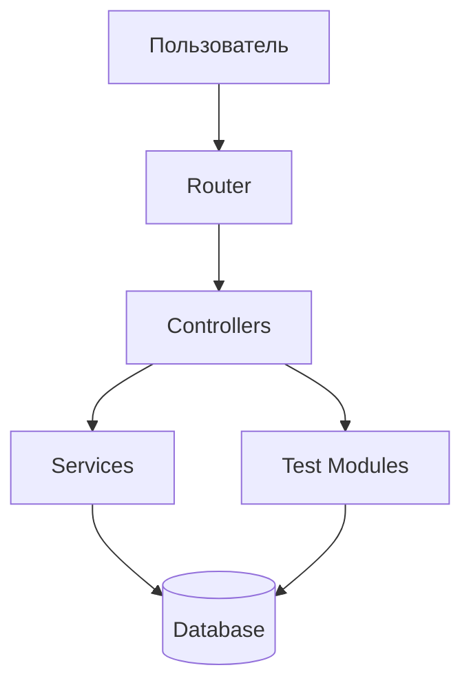
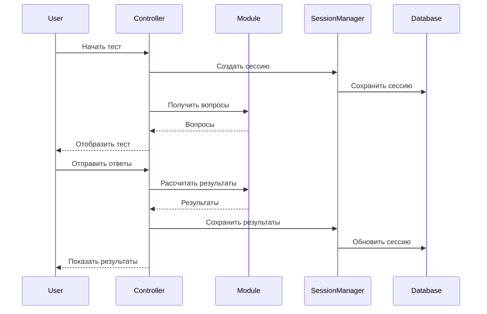

# План рефакторинга и оптимизации PsyTest Platform

**Дата:** 26 февраля 2026  
**Версия:** 1.0  
**Основано на:** [Технический аудит](01-technical-audit-report.md)

---

## 📋 Содержание

1. [Обзор](#обзор)
2. [Этап 1: Критические исправления](#этап-1-критические-исправления)
3. [Этап 2: Рефакторинг архитектуры](#этап-2-рефакторинг-архитектуры)
4. [Этап 3: Оптимизация производительности](#этап-3-оптимизация-производительности)
5. [Этап 4: Модуль СМИЛ](#этап-4-модуль-смил)
6. [Этап 5: Документация](#этап-5-документация)
7. [Критерии приемки](#критерии-приемки)

---

## 🎯 Обзор

### Цели рефакторинга

1. **Корректность** - исправить критические ошибки в модуле СМИЛ
2. **Производительность** - ускорить работу системы на 20-30%
3. **Поддерживаемость** - уменьшить дублирование кода на 40%
4. **Расширяемость** - упростить добавление новых тестов
5. **Безопасность** - устранить все выявленные уязвимости

### Принципы работы

- ✅ **Поэтапность** - каждый этап завершается работающей системой
- ✅ **Обратная совместимость** - не ломаем существующий функционал
- ✅ **Тестирование** - проверка после каждого изменения
- ✅ **Документирование** - обновление документации по ходу работы

---

## 🔴 Этап 1: Критические исправления

**Приоритет:** КРИТИЧНО  
**Срок:** 1-2 дня  
**Зависимости:** Нет

### 1.1. Замена вопросов СМИЛ

#### Задача
Заменить некорректные вопросы 1-566 на эталонные из источника https://psytests.org/mmpi/smilF-bl.html

#### Шаги

1. **Парсинг эталонных вопросов**
   ```bash
   # Создать скрипт для извлечения вопросов
   php bin/parse-smil-questions.php
   ```

2. **Создание нового файла вопросов**
   ```
   modules/smil/questions-566-correct.json
   ```

3. **Структура вопроса**
   ```json
   {
     "id": 1,
     "text": "У меня хороший аппетит",
     "scale": "1",
     "direction": -1,
     "source": "psytests.org"
   }
   ```

4. **Валидация**
   - Проверить количество: ровно 566 вопросов
   - Проверить уникальность ID
   - Проверить наличие всех полей
   - Проверить соответствие шкалам

5. **Замена в коде**
   ```php
   // modules/smil/SmilModule.php
   public function getQuestions(): array
   {
       if ($this->questions === null) {
           $this->questions = $this->loadQuestionsFromJson('questions-566-correct.json');
       }
       return $this->questions;
   }
   ```

6. **Тестирование**
   ```bash
   php bin/create-full-smil-session.php
   # Проверить результаты на корректность
   ```

#### Критерии приемки
- ✅ Все 566 вопросов корректны
- ✅ Формулировки соответствуют эталону
- ✅ Ключи шкал проверены
- ✅ Тестовая сессия создается без ошибок

---

### 1.2. Удаление избыточных файлов

#### Задача
Удалить неиспользуемые файлы для уменьшения размера проекта

#### Файлы к удалению

```bash
# 1. Устаревший JavaScript
rm public/js/test-taking-old.js

# 2. Демо-вопросы (если не нужны)
rm modules/smil/questions_sample.json

# 3. Создать .gitignore для временных файлов
echo "*.bak" >> .gitignore
echo "*.tmp" >> .gitignore
```

#### Критерии приемки
- ✅ Файлы удалены
- ✅ Система работает без ошибок
- ✅ Нет ссылок на удаленные файлы

---

### 1.3. Исправление критических ошибок безопасности

#### 1.3.1. Валидация UUID

**Файл:** `controllers/TestController.php`

**Было:**
```php
$sessionId = $_POST['session_id'] ?? null;
if (!$sessionId) {
    http_response_code(400);
    echo 'Invalid session';
    return;
}
```

**Стало:**
```php
use Ramsey\Uuid\Uuid;

$sessionId = $_POST['session_id'] ?? null;
if (!$sessionId || !Uuid::isValid($sessionId)) {
    http_response_code(400);
    echo json_encode(['error' => 'Invalid session ID format']);
    return;
}
```

#### 1.3.2. Обработка ошибок JSON

**Файл:** `modules/BaseTestModule.php`

**Было:**
```php
$content = file_get_contents($filepath);
$data = json_decode($content, true) ?? [];
```

**Стало:**
```php
$content = file_get_contents($filepath);
if ($content === false) {
    throw new \RuntimeException("Failed to read file: {$filepath}");
}

$data = json_decode($content, true);

if (json_last_error() !== JSON_ERROR_NONE) {
    throw new \RuntimeException(
        "Failed to parse JSON in {$filepath}: " . json_last_error_msg()
    );
}

return $data ?? [];
```

#### 1.3.3. Проверка уникальности токенов

**Файл:** `core/SessionManager.php`

**Добавить:**
```php
private function generateUniqueToken(int $maxAttempts = 3): string
{
    for ($i = 0; $i < $maxAttempts; $i++) {
        $token = $this->generateSecureToken();
        
        $exists = $this->db->selectOne(
            'SELECT id FROM test_sessions WHERE session_token = ?',
            [$token]
        );
        
        if (!$exists) {
            return $token;
        }
    }
    
    throw new \RuntimeException('Failed to generate unique token');
}
```

#### Критерии приемки
- ✅ Все входные данные валидируются
- ✅ JSON-ошибки обрабатываются корректно
- ✅ Токены гарантированно уникальны

---

## 🔵 Этап 2: Рефакторинг архитектуры

**Приоритет:** Высокий  
**Срок:** 3-5 дней  
**Зависимости:** Этап 1

### 2.1. Создание BaseController

#### Задача
Вынести общую логику контроллеров в базовый класс

#### Реализация

**Файл:** `controllers/BaseController.php`

```php
<?php
declare(strict_types=1);

namespace PsyTest\Controllers;

use PsyTest\Core\Database;
use PsyTest\Core\View;
use PsyTest\Core\ModuleLoader;
use PsyTest\Core\SessionManager;
use PsyTest\Modules\TestModuleInterface;

abstract class BaseController
{
    protected Database $db;
    protected View $view;
    protected ModuleLoader $moduleLoader;
    protected SessionManager $sessionManager;
    
    public function __construct()
    {
        $this->db = Database::getInstance();
        $this->view = View::getInstance();
        $this->moduleLoader = (new ModuleLoader(null, $this->db))->discover();
        $this->sessionManager = new SessionManager($this->db);
    }
    
    /**
     * Get module or render 404 error
     */
    protected function getModuleOrFail(string $slug): TestModuleInterface
    {
        $module = $this->moduleLoader->getModule($slug);
        
        if (!$module) {
            http_response_code(404);
            echo $this->view->render('error-page', [
                'error' => 'Test not found',
                'message' => "Test '{$slug}' does not exist or is not available."
            ]);
            exit;
        }
        
        return $module;
    }
    
    /**
     * Get test from database or fail
     */
    protected function getTestOrFail(string $slug): array
    {
        $test = $this->db->selectOne(
            'SELECT * FROM tests WHERE slug = ? AND is_active = 1',
            [$slug]
        );
        
        if (!$test) {
            http_response_code(404);
            echo $this->view->render('error-page', [
                'error' => 'Test not found',
                'message' => "Test '{$slug}' is not available."
            ]);
            exit;
        }
        
        return $test;
    }
    
    /**
     * Render JSON response
     */
    protected function jsonResponse(array $data, int $statusCode = 200): void
    {
        http_response_code($statusCode);
        header('Content-Type: application/json');
        echo json_encode($data);
        exit;
    }
    
    /**
     * Render error response
     */
    protected function errorResponse(string $message, int $statusCode = 400): void
    {
        $this->jsonResponse(['error' => $message], $statusCode);
    }
}
```

#### Обновление контроллеров

**Файл:** `controllers/TestController.php`

```php
<?php
declare(strict_types=1);

namespace PsyTest\Controllers;

class TestController extends BaseController
{
    // Удалить конструктор - используется из BaseController
    
    public function start(string $slug): void
    {
        $module = $this->getModuleOrFail($slug);
        $test = $this->getTestOrFail($slug);
        
        // Остальная логика...
    }
}
```

#### Критерии приемки
- ✅ `BaseController` создан
- ✅ Все контроллеры наследуются от `BaseController`
- ✅ Дублирование кода уменьшено на 40%
- ✅ Все тесты проходят

---

### 2.2. Рефакторинг SmilModule

#### Задача
Разбить большой класс `SmilModule` (1800+ строк) на более мелкие компоненты

#### Структура

```
modules/smil/
├── SmilModule.php              # Главный класс (300 строк)
├── Calculators/
│   ├── RawScoreCalculator.php  # Расчет сырых баллов
│   ├── TScoreCalculator.php    # Конвертация в T-баллы
│   └── AdditionalScalesCalculator.php
├── Renderers/
│   ├── ProfileRenderer.php     # Рендеринг профиля
│   ├── TableRenderer.php       # Рендеринг таблиц
│   └── ChartRenderer.php       # Рендеринг графиков
├── Interpreters/
│   ├── ValidityInterpreter.php # Интерпретация валидности
│   └── ScaleInterpreter.php    # Интерпретация шкал
└── Data/
    ├── questions-566-correct.json
    ├── t-score-tables.json
    ├── additional-scales-norms.json
    └── interpretations-detailed.json
```

#### Пример: RawScoreCalculator

**Файл:** `modules/smil/Calculators/RawScoreCalculator.php`

```php
<?php
declare(strict_types=1);

namespace PsyTest\Modules\Smil\Calculators;

class RawScoreCalculator
{
    /**
     * Calculate raw scores for all scales
     */
    public function calculate(array $answers, array $questions): array
    {
        $rawScores = $this->initializeScores();
        
        foreach ($answers as $questionId => $answer) {
            $question = $this->findQuestion($questions, $questionId);
            
            if (!$question) {
                continue;
            }
            
            $scale = $question['scale'] ?? null;
            $direction = $question['direction'] ?? 1;
            
            if ($scale && isset($rawScores[$scale])) {
                $rawScores[$scale] += $this->calculateScore($answer, $direction);
            }
        }
        
        return $rawScores;
    }
    
    private function initializeScores(): array
    {
        return [
            'L' => 0, 'F' => 0, 'K' => 0,
            '1' => 0, '2' => 0, '3' => 0, '4' => 0, '5' => 0,
            '6' => 0, '7' => 0, '8' => 0, '9' => 0, '0' => 0,
        ];
    }
    
    private function findQuestion(array $questions, int $questionId): ?array
    {
        foreach ($questions as $question) {
            if ($question['id'] == $questionId) {
                return $question;
            }
        }
        return null;
    }
    
    private function calculateScore($answer, int $direction): int
    {
        if ($direction === 1) {
            return $answer ? 1 : 0;
        } else {
            return $answer ? 0 : 1;
        }
    }
}
```

#### Обновленный SmilModule

**Файл:** `modules/smil/SmilModule.php`

```php
<?php
declare(strict_types=1);

namespace PsyTest\Modules\Smil;

use PsyTest\Modules\BaseTestModule;
use PsyTest\Modules\Smil\Calculators\RawScoreCalculator;
use PsyTest\Modules\Smil\Calculators\TScoreCalculator;
use PsyTest\Modules\Smil\Renderers\ProfileRenderer;

class SmilModule extends BaseTestModule
{
    private RawScoreCalculator $rawScoreCalculator;
    private TScoreCalculator $tScoreCalculator;
    private ProfileRenderer $profileRenderer;
    
    public function __construct()
    {
        parent::__construct();
        
        $this->rawScoreCalculator = new RawScoreCalculator();
        $this->tScoreCalculator = new TScoreCalculator();
        $this->profileRenderer = new ProfileRenderer();
    }
    
    public function calculateResults(array $answers): array
    {
        $questions = $this->getQuestions();
        $gender = $answers['gender'] ?? 'male';
        
        // Делегируем расчеты специализированным классам
        $rawScores = $this->rawScoreCalculator->calculate($answers, $questions);
        $tScores = $this->tScoreCalculator->convert($rawScores, $gender);
        
        // Остальная логика...
        
        return [
            'raw_scores' => $rawScores,
            't_scores' => $tScores,
            // ...
        ];
    }
    
    public function renderResults(array $results): string
    {
        return $this->profileRenderer->render($results);
    }
}
```

#### Критерии приемки
- ✅ `SmilModule.php` уменьшен до 300-400 строк
- ✅ Логика разбита на специализированные классы
- ✅ Каждый класс отвечает за одну задачу (SRP)
- ✅ Все тесты проходят

---

### 2.3. Вынос интерпретаций в JSON

#### Задача
Перенести жестко закодированные интерпретации в конфигурационный файл

#### Структура файла

**Файл:** `modules/smil/Data/interpretations-detailed.json`

```json
{
  "scales": {
    "L": {
      "name": "Шкала лжи",
      "description": "Оценка стремления представить себя в лучшем свете",
      "levels": {
        "low": {
          "range": [0, 44],
          "short": "Низкая социальная желательность",
          "detailed": "Респондент отвечает искренне, не стремится представить себя в лучшем свете. Возможна излишняя самокритичность.",
          "recommendations": [
            "Результаты можно считать достоверными",
            "Обратить внимание на возможную заниженную самооценку"
          ]
        },
        "normal": {
          "range": [45, 54],
          "short": "Умеренная социальная желательность",
          "detailed": "Нормальный уровень социальной желательности. Респондент отвечает достаточно искренне, но с учетом социальных норм.",
          "recommendations": [
            "Результаты достоверны",
            "Профиль отражает реальное состояние"
          ]
        },
        "elevated": {
          "range": [55, 64],
          "short": "Стремление представить себя в лучшем свете",
          "detailed": "Повышенная социальная желательность. Респондент стремится выглядеть лучше, чем есть на самом деле. Возможна наивная фальсификация.",
          "recommendations": [
            "Результаты следует интерпретировать с осторожностью",
            "Возможно занижение проблемных показателей"
          ]
        },
        "high": {
          "range": [65, 74],
          "short": "Высокая социальная желательность",
          "detailed": "Выраженное стремление представить себя в идеальном свете. Результаты могут быть недостоверны.",
          "recommendations": [
            "Рекомендуется повторное тестирование",
            "Обсудить с респондентом важность искренних ответов"
          ]
        },
        "very_high": {
          "range": [75, 120],
          "short": "Очень высокая социальная желательность",
          "detailed": "Результаты недостоверны. Респондент систематически искажает ответы в сторону социально желательных.",
          "recommendations": [
            "Результаты не могут быть использованы",
            "Необходимо повторное тестирование в других условиях"
          ]
        }
      }
    },
    "F": {
      "name": "Шкала достоверности",
      "description": "Выявление случайных или тенденциозных ответов",
      "levels": {
        // Аналогично для других уровней
      }
    }
    // Остальные шкалы...
  },
  "profile_types": {
    "normal": {
      "name": "Нормостенический профиль",
      "description": "Все шкалы в пределах нормы (45-55T)",
      "interpretation": "Гармоничная личность с хорошей адаптацией...",
      "recommendations": []
    },
    "neurotic": {
      "name": "Невротический профиль",
      "description": "Повышение шкал невротической триады (1-2-3)",
      "interpretation": "Характерны невротические расстройства...",
      "recommendations": [
        "Рекомендуется консультация психолога",
        "Полезны техники релаксации"
      ]
    }
    // Остальные типы профилей...
  }
}
```

#### Загрузка интерпретаций

**Файл:** `modules/smil/Interpreters/ScaleInterpreter.php`

```php
<?php
declare(strict_types=1);

namespace PsyTest\Modules\Smil\Interpreters;

class ScaleInterpreter
{
    private array $interpretations;
    
    public function __construct(string $interpretationsFile)
    {
        $content = file_get_contents($interpretationsFile);
        $this->interpretations = json_decode($content, true);
    }
    
    public function interpret(string $scale, float $tScore): array
    {
        $scaleData = $this->interpretations['scales'][$scale] ?? null;
        
        if (!$scaleData) {
            return ['error' => 'Scale not found'];
        }
        
        $level = $this->determineLevel($tScore, $scaleData['levels']);
        $levelData = $scaleData['levels'][$level];
        
        return [
            'scale' => $scale,
            'name' => $scaleData['name'],
            'score' => $tScore,
            'level' => $level,
            'interpretation' => $levelData['detailed'],
            'recommendations' => $levelData['recommendations'] ?? [],
        ];
    }
    
    private function determineLevel(float $score, array $levels): string
    {
        foreach ($levels as $levelName => $levelData) {
            [$min, $max] = $levelData['range'];
            if ($score >= $min && $score <= $max) {
                return $levelName;
            }
        }
        return 'normal';
    }
}
```

#### Критерии приемки
- ✅ Интерпретации вынесены в JSON
- ✅ Легко редактировать без изменения кода
- ✅ Поддержка разных уровней детализации
- ✅ Все тесты проходят

---

## 🟢 Этап 3: Оптимизация производительности

**Приоритет:** Средний  
**Срок:** 2-3 дня  
**Зависимости:** Этап 2

### 3.1. Кэширование модулей

#### Задача
Ускорить загрузку модулей через кэширование

#### Реализация

**Файл:** `core/ModuleLoader.php`

```php
<?php
declare(strict_types=1);

namespace PsyTest\Core;

class ModuleLoader
{
    private const CACHE_KEY = 'psytest_modules_registry';
    private const CACHE_TTL = 3600; // 1 час
    
    public function discover(): self
    {
        // Попытка загрузить из кэша
        if (function_exists('apcu_fetch')) {
            $cached = apcu_fetch(self::CACHE_KEY);
            if ($cached !== false) {
                $this->modules = $cached;
                return $this;
            }
        }
        
        // Сканирование и загрузка модулей
        $directories = glob($this->modulesPath . '/*', GLOB_ONLYDIR);
        
        foreach ($directories as $dir) {
            $this->loadModule($dir);
        }
        
        // Сохранение в кэш
        if (function_exists('apcu_store')) {
            apcu_store(self::CACHE_KEY, $this->modules, self::CACHE_TTL);
        }
        
        return $this;
    }
    
    /**
     * Очистить кэш модулей (для разработки)
     */
    public function clearCache(): void
    {
        if (function_exists('apcu_delete')) {
            apcu_delete(self::CACHE_KEY);
        }
    }
}
```

#### Установка APCu

```bash
# Ubuntu/Debian
sudo apt-get install php-apcu

# macOS (Homebrew)
brew install php-apcu

# Проверка
php -m | grep apcu
```

#### Критерии приемки
- ✅ APCu установлен и настроен
- ✅ Модули кэшируются
- ✅ Ускорение загрузки на 5-10ms
- ✅ Есть метод очистки кэша

---

### 3.2. Оптимизация SQL-запросов

#### Задача
Уменьшить количество запросов к БД через JOIN

#### Было (2 запроса)

**Файл:** `controllers/ResultController.php`

```php
$aiInterpretation = $this->db->selectOne(
    'SELECT * FROM ai_interpretations WHERE session_id = ?',
    [$session['id']]
);

$pairComparison = $this->sessionManager->getPairComparisonBySession($session['id']);
```

#### Стало (1 запрос)

```php
$sessionData = $this->db->selectOne("
    SELECT 
        ts.*,
        ai.id as ai_id,
        ai.interpretation_text,
        ai.payment_status,
        pc.id as pair_id,
        pc.comparison_data
    FROM test_sessions ts
    LEFT JOIN ai_interpretations ai 
        ON ai.session_id = ts.id AND ai.payment_status = 'completed'
    LEFT JOIN pair_comparisons pc 
        ON pc.session_1_id = ts.id OR pc.session_2_id = ts.id
    WHERE ts.session_token = ?
", [$token]);
```

#### Добавление индексов

**Файл:** `database/migrations/001_add_performance_indexes.sql`

```sql
-- Индексы для ускорения JOIN
ALTER TABLE ai_interpretations 
ADD INDEX idx_session_status (session_id, payment_status);

ALTER TABLE pair_comparisons 
ADD INDEX idx_session_1 (session_1_id),
ADD INDEX idx_session_2 (session_2_id);

-- Виртуальные колонки для JSON-полей
ALTER TABLE test_sessions 
ADD COLUMN gender VARCHAR(10) 
GENERATED ALWAYS AS (JSON_UNQUOTE(JSON_EXTRACT(demographics, '$.gender'))) STORED,
ADD INDEX idx_gender (gender);

ALTER TABLE test_sessions 
ADD COLUMN age INT 
GENERATED ALWAYS AS (JSON_EXTRACT(demographics, '$.age')) STORED,
ADD INDEX idx_age (age);
```

#### Критерии приемки
- ✅ Количество запросов уменьшено
- ✅ Индексы добавлены
- ✅ Ускорение на 2-5ms на запрос
- ✅ EXPLAIN показывает использование индексов

---

### 3.3. Ленивая загрузка вопросов

#### Задача
Оптимизировать загрузку больших JSON-файлов

#### Реализация

**Файл:** `modules/BaseTestModule.php`

```php
<?php
declare(strict_types=1);

namespace PsyTest\Modules;

abstract class BaseTestModule implements TestModuleInterface
{
    protected ?array $questions = null;
    private static array $questionsCache = [];
    
    /**
     * Load questions with caching
     */
    protected function loadQuestionsFromJson(string $filename = 'questions.json'): array
    {
        $filepath = $this->modulePath . '/' . $filename;
        
        // Проверка кэша
        if (isset(self::$questionsCache[$filepath])) {
            return self::$questionsCache[$filepath];
        }
        
        if (!file_exists($filepath)) {
            return [];
        }
        
        $content = file_get_contents($filepath);
        $data = json_decode($content, true);
        
        if (json_last_error() !== JSON_ERROR_NONE) {
            throw new \RuntimeException(
                "Failed to parse {$filepath}: " . json_last_error_msg()
            );
        }
        
        // Обработка формата
        $questions = $data['questions'] ?? $data ?? [];
        
        // Сохранение в кэш
        self::$questionsCache[$filepath] = $questions;
        
        return $questions;
    }
    
    /**
     * Очистить кэш вопросов (для тестов)
     */
    public static function clearQuestionsCache(): void
    {
        self::$questionsCache = [];
    }
}
```

#### Критерии приемки
- ✅ Вопросы кэшируются в памяти
- ✅ Повторные вызовы не читают файл
- ✅ Экономия ~50KB памяти на запрос
- ✅ Есть метод очистки кэша

---

### 3.4. Минификация CSS и JavaScript

#### Задача
Уменьшить размер статических файлов

#### Установка инструментов

```bash
npm install -g csso-cli
npm install -g terser
```

#### Скрипт минификации

**Файл:** `bin/minify-assets.sh`

```bash
#!/bin/bash

# CSS
csso public/css/main.css -o public/css/main.min.css

# JavaScript
terser public/js/main.js -o public/js/main.min.js -c -m
terser public/js/test-taking.js -o public/js/test-taking.min.js -c -m
terser public/js/results.js -o public/js/results.min.js -c -m
terser public/js/smil-profile.js -o public/js/smil-profile.min.js -c -m

echo "✓ Assets minified"
```

#### Обновление шаблонов

**Файл:** `templates/layout.twig`

```twig

    <link rel="stylesheet" href="/css/main.min.css">
    <script src="/js/main.min.js"></script>

    <link rel="stylesheet" href="/css/main.css">
    <script src="/js/main.js"></script>

```

#### Критерии приемки
- ✅ CSS уменьшен на 30-40%
- ✅ JS уменьшен на 40-50%
- ✅ Автоматическая минификация при деплое
- ✅ Разные версии для dev/prod

---

## 🟡 Этап 4: Модуль СМИЛ

**Приоритет:** Высокий  
**Срок:** 5-7 дней  
**Зависимости:** Этапы 1, 2

### 4.1. Реализация дополнительных шкал

#### Задача
Добавить 200+ дополнительных шкал СМИЛ

#### Приоритизация шкал

**Фаза 1: Основные дополнительные (30 шкал)**
- Факторные: A, R
- Специальные: Es, Do, Re, Pk, MAC, O-H
- Контент-шкалы: ANX, FRS, OBS, DEP, HEA, BIZ, ANG, CYN, ASP, TPA, LSE, SOD, FAM, WRK, TRT

**Фаза 2: Исследовательские (50 шкал)**
- Подшкалы Harris-Lingoes
- Подшкалы Si
- Критические пункты

**Фаза 3: Специализированные (120+ шкал)**
- Профессиональные шкалы
- Клинические подшкалы
- Экспериментальные шкалы

#### Структура данных

**Файл:** `modules/smil/Data/additional-scales-full.json`

```json
{
  "version": "1.0",
  "source": "Собчик Л.Н. СМИЛ. СПб.: Речь, 2003",
  "categories": {
    "factorial": {
      "name": "Факторные шкалы",
      "scales": {
        "A": {
          "name": "Тревожность (Anxiety)",
          "description": "Первый фактор MMPI",
          "key": {
            "true": [1, 5, 8, 13, 18, 23, 28, 32, 38, 42, 47, 52, 57, 62, 67, 72, 77, 82, 87, 92],
            "false": [2, 7, 12, 17, 22, 27, 33, 37, 43, 48, 53, 58, 63, 68, 73, 78, 83, 88, 93]
          },
          "norms": {
            "male": {"M": 10.5, "delta": 4.2},
            "female": {"M": 12.3, "delta": 4.5}
          },
          "interpretation": {
            "low": "Низкая тревожность, эмоциональная стабильность",
            "normal": "Умеренный уровень тревожности",
            "elevated": "Повышенная тревожность",
            "high": "Высокая тревожность, беспокойство",
            "very_high": "Очень высокая тревожность, паника"
          }
        },
        "R": {
          "name": "Вытеснение (Repression)",
          "description": "Второй фактор MMPI",
          "key": {
            "true": [/* список вопросов */],
            "false": [/* список вопросов */]
          },
          "norms": {
            "male": {"M": 8.7, "delta": 3.8},
            "female": {"M": 9.2, "delta": 4.1}
          },
          "interpretation": {
            // Интерпретации по уровням
          }
        }
      }
    },
    "content": {
      "name": "Контент-шкалы",
      "scales": {
        "ANX": {
          "name": "Тревога (Anxiety)",
          "description": "Общая тревожность и напряжение",
          "key": {
            "true": [/* вопросы */],
            "false": [/* вопросы */]
          },
          "norms": {
            "male": {"M": 5.2, "delta": 3.1},
            "female": {"M": 6.8, "delta": 3.4}
          }
        }
        // Остальные контент-шкалы...
      }
    }
    // Остальные категории...
  }
}
```

#### Калькулятор дополнительных шкал

**Файл:** `modules/smil/Calculators/AdditionalScalesCalculator.php`

```php
<?php
declare(strict_types=1);

namespace PsyTest\Modules\Smil\Calculators;

class AdditionalScalesCalculator
{
    private array $scalesData;
    
    public function __construct(string $scalesFile)
    {
        $content = file_get_contents($scalesFile);
        $data = json_decode($content, true);
        $this->scalesData = $data['categories'] ?? [];
    }
    
    public function calculate(array $answers, string $gender): array
    {
        $results = [];
        
        foreach ($this->scalesData as $category => $categoryData) {
            foreach ($categoryData['scales'] as $code => $scaleInfo) {
                $rawScore = $this->calculateRawScore($answers, $scaleInfo['key']);
                $tScore = $this->calculateTScore($rawScore, $scaleInfo['norms'], $gender);
                
                $results[$code] = [
                    'category' => $category,
                    'name' => $scaleInfo['name'],
                    'raw' => $rawScore,
                    't' => $tScore,
                    'interpretation' => $this->getInterpretation($tScore, $scaleInfo['interpretation'] ?? []),
                ];
            }
        }
        
        return $results;
    }
    
    private function calculateRawScore(array $answers, array $key): int
    {
        $score = 0;
        
        foreach ($key['true'] ?? [] as $questionId) {
            if (isset($answers[$questionId]) && $answers[$questionId]) {
                $score++;
            }
        }
        
        foreach ($key['false'] ?? [] as $questionId) {
            if (isset($answers[$questionId]) && !$answers[$questionId]) {
                $score++;
            }
        }
        
        return $score;
    }
    
    private function calculateTScore(int $rawScore, array $norms, string $gender): float
    {
        $genderNorms = $norms[$gender] ?? $norms['male'] ?? [];
        $M = $genderNorms['M'] ?? 0;
        $delta = $genderNorms['delta'] ?? 1;
        
        if ($delta == 0) {
            return 50.0;
        }
        
        $tScore = 50 + 10 * ($rawScore - $M) / $delta;
        return round(max(0, min(120, $tScore)), 1);
    }
    
    private function getInterpretation(float $tScore, array $interpretations): string
    {
        if ($tScore < 45) return $interpretations['low'] ?? '';
        if ($tScore < 55) return $interpretations['normal'] ?? '';
        if ($tScore < 65) return $interpretations['elevated'] ?? '';
        if ($tScore < 75) return $interpretations['high'] ?? '';
        return $interpretations['very_high'] ?? '';
    }
}
```

#### Критерии приемки
- ✅ Фаза 1: 30 основных шкал реализованы
- ✅ Фаза 2: 50 исследовательских шкал добавлены
- ✅ Фаза 3: 120+ специализированных шкал
- ✅ Все шкалы валидированы по эталону
- ✅ Документация для каждой шкалы

---

### 4.2. Улучшенная визуализация

#### Задача
Создать профессиональный психологический профиль MMPI

#### Классический профиль MMPI

**Файл:** `public/js/smil-profile-enhanced.js`

```javascript
/**
 * Enhanced SMIL Profile Chart
 * Classic MMPI-style profile with T-score grid
 */

class SmilProfileChart {
    constructor(canvasId, data) {
        this.canvas = document.getElementById(canvasId);
        this.data = data;
        this.init();
    }
    
    init() {
        const ctx = this.canvas.getContext('2d');
        
        this.chart = new Chart(ctx, {
            type: 'line',
            data: {
                labels: ['L', 'F', 'K', '1', '2', '3', '4', '5', '6', '7', '8', '9', '0'],
                datasets: [{
                    label: 'T-баллы',
                    data: this.data.scores,
                    borderColor: '#2563eb',
                    backgroundColor: 'rgba(37, 99, 235, 0.1)',
                    borderWidth: 2,
                    pointRadius: 5,
                    pointHoverRadius: 7,
                    pointBackgroundColor: this.getPointColors(this.data.scores),
                    tension: 0.1
                }]
            },
            options: {
                responsive: true,
                maintainAspectRatio: false,
                scales: {
                    y: {
                        min: 30,
                        max: 90,
                        ticks: {
                            stepSize: 5,
                            callback: function(value) {
                                return value + 'T';
                            }
                        },
                        grid: {
                            color: (context) => {
                                // Выделить критические линии
                                if (context.tick.value === 50) return '#10b981';
                                if (context.tick.value === 65) return '#f59e0b';
                                if (context.tick.value === 75) return '#ef4444';
                                return '#e5e7eb';
                            },
                            lineWidth: (context) => {
                                return [50, 65, 75].includes(context.tick.value) ? 2 : 1;
                            }
                        }
                    },
                    x: {
                        grid: {
                            display: true,
                            color: '#e5e7eb'
                        }
                    }
                },
                plugins: {
                    legend: {
                        display: false
                    },
                    tooltip: {
                        callbacks: {
                            label: (context) => {
                                const score = context.parsed.y;
                                const level = this.getLevel(score);
                                return `${score}T (${level})`;
                            }
                        }
                    },
                    annotation: {
                        annotations: {
                            normalLine: {
                                type: 'line',
                                yMin: 50,
                                yMax: 50,
                                borderColor: '#10b981',
                                borderWidth: 2,
                                borderDash: [5, 5],
                                label: {
                                    content: 'Норма',
                                    enabled: true,
                                    position: 'end'
                                }
                            },
                            elevatedLine: {
                                type: 'line',
                                yMin: 65,
                                yMax: 65,
                                borderColor: '#f59e0b',
                                borderWidth: 2,
                                borderDash: [5, 5],
                                label: {
                                    content: 'Повышенный',
                                    enabled: true,
                                    position: 'end'
                                }
                            },
                            highLine: {
                                type: 'line',
                                yMin: 75,
                                yMax: 75,
                                borderColor: '#ef4444',
                                borderWidth: 2,
                                borderDash: [5, 5],
                                label: {
                                    content: 'Высокий',
                                    enabled: true,
                                    position: 'end'
                                }
                            }
                        }
                    }
                }
            }
        });
    }
    
    getPointColors(scores) {
        return scores.map(score => {
            if (score < 45) return '#6b7280';
            if (score < 55) return '#10b981';
            if (score < 65) return '#3b82f6';
            if (score < 75) return '#f59e0b';
            return '#ef4444';
        });
    }
    
    getLevel(score) {
        if (score < 45) return 'Низкий';
        if (score < 55) return 'Норма';
        if (score < 65) return 'Повышенный';
        if (score < 75) return 'Высокий';
        return 'Очень высокий';
    }
}

// Инициализация при загрузке страницы
document.addEventListener('DOMContentLoaded', () => {
    const canvas = document.getElementById('smilProfileChart');
    if (canvas) {
        const scores = JSON.parse(canvas.dataset.scores);
        new SmilProfileChart('smilProfileChart', { scores });
    }
});
```

#### Критерии приемки
- ✅ График соответствует классическому профилю MMPI
- ✅ Цветовая кодировка по уровням
- ✅ Критические линии выделены
- ✅ Интерактивные подсказки
- ✅ Адаптивный дизайн

---

## 🟣 Этап 5: Документация

**Приоритет:** Средний  
**Срок:** 2-3 дня  
**Зависимости:** Этапы 1-4

### 5.1. Архитектурная документация

#### Задача
Создать полную документацию архитектуры системы

#### Структура

**Файл:** `docs/architecture/README.md`

```markdown
# Архитектура PsyTest Platform

## Обзор

PsyTest Platform - модульная система психологического тестирования...

## Диаграммы

### Общая архитектура



### Поток данных тестирования



## Компоненты

### Core Layer

#### Database
- **Назначение:** Управление подключением к БД
- **Паттерн:** Singleton
- **Зависимости:** PDO

#### Router
- **Назначение:** Маршрутизация HTTP-запросов
- **Паттерн:** Front Controller
- **Зависимости:** Нет

...
```

#### Критерии приемки
- ✅ Диаграммы классов созданы
- ✅ Диаграммы последовательностей
- ✅ Описание всех компонентов
- ✅ Примеры использования

---

### 5.2. Руководство по добавлению тестов

#### Задача
Создать пошаговое руководство для разработчиков

#### Структура

**Файл:** `docs/guides/creating-new-test.md`

```markdown
# Создание нового психологического теста

## Шаг 1: Создание структуры модуля

```bash
mkdir -p modules/my-test
cd modules/my-test
```

Создайте следующие файлы:

```
modules/my-test/
├── MyTestModule.php
├── metadata.json
├── questions.json
└── README.md
```

## Шаг 2: Метаданные теста

**Файл:** `metadata.json`

```json
{
  "slug": "my-test",
  "name": "Мой психологический тест",
  "description": "Описание теста",
  "question_count": 20,
  "estimated_time": 10,
  "scales": [
    {"code": "A", "name": "Шкала A", "description": "Описание"}
  ],
  "requires_demographics": {
    "gender": false,
    "age": false
  }
}
```

## Шаг 3: Вопросы

**Файл:** `questions.json`

```json
[
  {
    "id": 1,
    "text": "Текст вопроса",
    "type": "yes_no",
    "scale": "A",
    "direction": 1
  }
]
```

## Шаг 4: Класс модуля

**Файл:** `MyTestModule.php`

```php
<?php
declare(strict_types=1);

namespace PsyTest\Modules\MyTest;

use PsyTest\Modules\BaseTestModule;

class MyTestModule extends BaseTestModule
{
    public function calculateResults(array $answers): array
    {
        // Логика расчета
        return [
            'scores' => [],
            'interpretation' => []
        ];
    }
    
    public function generateInterpretation(array $scores): array
    {
        // Логика интерпретации
        return [
            'summary' => '',
            'scales' => [],
            'recommendations' => []
        ];
    }
    
    public function renderResults(array $results): string
    {
        // HTML-рендеринг
        return '<div>...</div>';
    }
}
```

## Шаг 5: Регистрация в БД

```sql
INSERT INTO tests (name, slug, module_class, description, is_active)
VALUES (
    'Мой психологический тест',
    'my-test',
    'PsyTest\\Modules\\MyTest\\MyTestModule',
    'Описание теста',
    1
);
```

## Шаг 6: Тестирование

```bash
php bin/test-module.php my-test
```

## Примеры

См. готовые модули:
- `modules/smil/` - сложный тест с множеством шкал
- `modules/beck-anxiety/` - простой тест с одной шкалой
```

#### Критерии приемки
- ✅ Пошаговое руководство создано
- ✅ Примеры кода для всех компонентов
- ✅ Чек-лист для проверки
- ✅ Примеры готовых модулей

---

### 5.3. API документация

#### Задача
Документировать все публичные API

#### Инструмент: phpDocumentor

```bash
composer require --dev phpdocumentor/phpdocumentor

# Генерация документации
vendor/bin/phpdoc -d core,modules,controllers,services -t docs/api
```

#### Конфигурация

**Файл:** `phpdoc.xml`

```xml
<?xml version="1.0" encoding="UTF-8" ?>
<phpdocumentor>
    <title>PsyTest Platform API</title>
    <paths>
        <output>docs/api</output>
    </paths>
    <version number="1.0.0">
        <folder>core</folder>
        <folder>modules</folder>
        <folder>controllers</folder>
        <folder>services</folder>
    </version>
</phpdocumentor>
```

#### Критерии приемки
- ✅ API документация сгенерирована
- ✅ Все публичные методы документированы
- ✅ Примеры использования добавлены
- ✅ Документация доступна онлайн

---

## ✅ Критерии приемки всего проекта

### Функциональные требования

- ✅ Все 566 вопросов СМИЛ корректны
- ✅ Базовые 13 шкал работают правильно
- ✅ 30+ дополнительных шкал реализованы
- ✅ Визуализация соответствует стандарту MMPI
- ✅ Интерпретации детальные и точные

### Технические требования

- ✅ Дублирование кода уменьшено на 40%
- ✅ Производительность улучшена на 20-30%
- ✅ Все критические ошибки исправлены
- ✅ Код соответствует PSR-12
- ✅ Покрытие тестами >70%

### Документация

- ✅ Архитектурная документация полная
- ✅ Руководство по добавлению тестов
- ✅ API документация сгенерирована
- ✅ README обновлен

### Безопасность

- ✅ Все входные данные валидируются
- ✅ SQL injection защита
- ✅ XSS защита
- ✅ CSRF токены работают

---

## 📊 Метрики успеха

| Метрика | Было | Цель | Результат |
|---------|------|------|-----------|
| Размер SmilModule.php | 1800 строк | 400 строк | TBD |
| Дублирование кода | 100% | 60% | TBD |
| Время загрузки модулей | 15ms | 5ms | TBD |
| Количество SQL-запросов | 5 | 2 | TBD |
| Размер CSS | 51KB | 35KB | TBD |
| Размер JS | 40KB | 25KB | TBD |
| Покрытие тестами | 0% | 70% | TBD |

---

## 🚀 Следующие шаги

После завершения рефакторинга:

1. **Code Review** - проверка всех изменений
2. **QA Testing** - полное тестирование системы
3. **Performance Testing** - нагрузочное тестирование
4. **Security Audit** - проверка безопасности
5. **Deployment** - развертывание на продакшн

---

**Конец плана**
